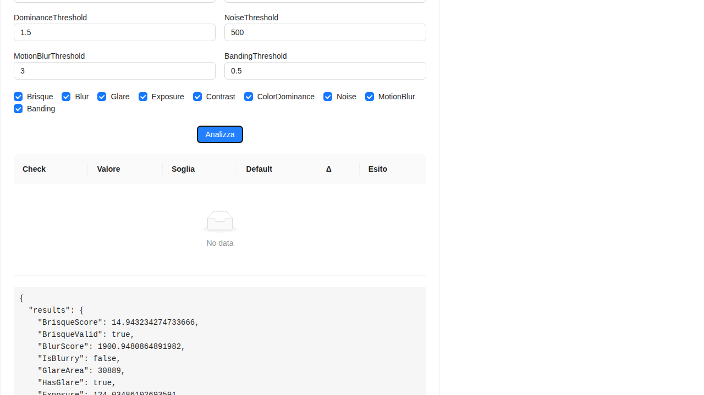

# Image Quality Scanner

Questa libreria fornisce semplici controlli di qualità su immagini di documenti tramite API gestite.
L'implementazione utilizza [SkiaSharp](https://github.com/mono/SkiaSharp) per la manipolazione delle immagini.

## Requisiti

 - .NET 9 SDK

Le dipendenze NuGet vengono ripristinate automaticamente durante la fase di build/test.


## Controlli di qualità
La classe `DocumentQualityChecker` esegue diversi controlli sull'immagine:

### BrisqueScore
Il BRISQUE (Blind/Referenceless Image Spatial Quality Evaluator) è un indice di qualità senza riferimento. In questa implementazione semplificata il punteggio è calcolato dalla varianza dei livelli di intensità e viene normalizzato tra 0 (immagine ideale) e 100 (scarsa qualità). Il valore ottimale è **inferiore a 50** (impostazione `BrisqueMax`).

### IsBlurry
Verifica la nitidezza calcolando la varianza del filtro Laplaciano. Restituisce un punteggio numerico e un booleano. Valori maggiori di **100** indicano un'immagine nitida; valori inferiori la rendono sfocata (`BlurThreshold`).

### HasGlare
Conta i pixel con intensità oltre **240** e verifica che l'area sia minore di **500** pixel. Se l'area luminosa supera la soglia (`AreaThreshold`) l'immagine contiene riflessi.

### Esposizione
Calcola la luminanza media usando la formula `0.299R + 0.587G + 0.114B` e verifica che sia compresa tra `ExposureMin` e `ExposureMax` (80-180 di default).

### Contrasto
Analizza la deviazione standard della luminanza. Valori inferiori a `ContrastMin` (30) indicano un contrasto insufficiente.

### Dominanza colore
Verifica se un canale RGB domina sugli altri calcolando il rapporto tra il canale più elevato e la media. Se il rapporto supera `DominanceThreshold` (1.5) l'immagine presenta una dominante.

### Rumore
Stima il rumore confrontando ogni pixel con la media dei vicini. Se il valore supera `NoiseThreshold` (20) il disturbo è considerato eccessivo.

### Motion blur
Calcola il rapporto tra le variazioni orizzontali e verticali dei pixel. Valori molto distanti da 1 indicano una sfocatura dovuta al movimento (`MotionBlurThreshold`).

### Bande orizzontali/verticali
Misura la varianza delle medie di righe e colonne per rilevare la presenza di bande uniformi. Un punteggio elevato (oltre `BandingThreshold`) segnala possibili difetti di scansione.

### CheckQuality
Combina i controlli precedenti usando le soglie definite in `QualitySettings` e restituisce un `DocumentQualityResult` con tutti i valori ottenuti.

Le soglie sono configurabili tramite l'oggetto `QualitySettings`. Impostando `GenerateHeatmaps` a `true` è inoltre possibile ottenere due bitmap (`BlurHeatmap` e `GlareHeatmap`) che evidenziano rispettivamente le zone sfocate e quelle colpite da riflessi. Nello stesso modo vengono calcolate anche le coordinate di tali aree tramite le liste `BlurRegions` e `GlareRegions` restituite nel `DocumentQualityResult`.

## Parametri configurabili
La classe `QualitySettings` consente di personalizzare le soglie utilizzate nei vari controlli. Nella tabella seguente sono riportati tutti i parametri disponibili, con i valori di default e alcune indicazioni su come regolarli a seconda delle esigenze:

| Proprietà | Descrizione | Valore predefinito | Note sull'utilizzo |
|-----------|-------------|--------------------|--------------------|
| `BrisqueMax` | Valore massimo accettabile del punteggio BRISQUE. | `50.0` | Ridurre il valore per richiedere una qualità più elevata, aumentarlo per essere meno restrittivi. |
| `BlurThreshold` | Soglia sulla varianza del Laplaciano sotto la quale l'immagine è considerata sfocata. | `100.0` | Se le immagini risultano troppo frequentemente "blurry" è possibile abbassare la soglia. |
| `BrightThreshold` | Intensità (0-255) oltre la quale un pixel è considerato riflesso. | `240` | Valori più alti evitano falsi positivi in condizioni luminose. |
| `AreaThreshold` | Numero minimo di pixel luminosi per dichiarare la presenza di glare. | `500` | Diminuire se si vogliono individuare anche riflessi di piccole dimensioni. |
| `ExposureMin` | Luminanza media minima accettabile. | `80.0` | Aumentare se le immagini tendono ad essere troppo scure. |
| `ExposureMax` | Luminanza media massima accettabile. | `180.0` | Ridurre se le immagini sono spesso sovraesposte. |
| `ContrastMin` | Deviazione standard minima della luminanza per considerare sufficiente il contrasto. | `30.0` | Alzare la soglia richiede un contrasto maggiore. |
| `DominanceThreshold` | Rapporto massimo tra il canale dominante e la media degli altri due. | `1.5` | Ridurre se è necessario rilevare anche dominanti cromatiche leggere. |
| `NoiseThreshold` | Livello massimo di rumore ammesso. | `500.0` | Diminuire per ottenere immagini molto pulite, aumentare se il rumore non è un problema. |
| `MotionBlurThreshold` | Rapporto massimo tra gradienti orizzontali e verticali prima di considerare il movimento. | `3.0` | Valori più bassi rendono il controllo più severo. |
| `BandingThreshold` | Soglia sul rapporto di varianza delle righe/colonne per individuare bande. | `0.5` | Aumentare se si vogliono rilevare solo bande marcate. |
| `GenerateHeatmaps` | Se `true` produce le mappe di calore e le coordinate delle aree problematiche. | `false` | Utile in fase di debug o per applicazioni che devono mostrare i punti da correggere. |

## API REST

Il progetto `DocQualityChecker.Api` espone un endpoint `POST /quality/check` per
eseguire i controlli via HTTP. L'input è un form con i campi:

- `image` (file) immagine da analizzare
- `checks` (opzionale) lista di controlli da eseguire
- `settings` (opzionale) oggetto `QualitySettings` per personalizzare le soglie

Se `settings.generateHeatmaps` è impostato a `true` la risposta includerà le
mappe di calore in formato base64 (`BlurHeatmap` e `GlareHeatmap`) e le
relative regioni (`BlurRegions`, `GlareRegions`).

## Esecuzione dei test

1. Installare lo SDK .NET 9 (se non presente).
2. Dalla cartella del progetto eseguire:

```bash
dotnet test DocQualityChecker.Tests/DocQualityChecker.Tests.csproj -c Release
```

I test creeranno alcune immagini di prova e verificheranno le funzioni di blur, glare, esposizione, contrasto, dominante colore e rumore.


## Esempi di output dei test

Le immagini generate dai test possono essere replicate eseguendo il progetto `DocsGenerator`:

```bash
dotnet run --project DocsGenerator/DocsGenerator.csproj -c Release
```

I file saranno salvati nella cartella `docs/images`. Qui sotto sono riportati i principali casi di test con i valori ottenuti e le relative immagini.

### Immagine ad alta qualità


```
BrisqueScore: 6.50
BlurScore: 661.16
IsBlurry: False
GlareArea: 0
HasGlare: False
Exposure: 176.00
IsWellExposed: True
Contrast: 64.99
HasLowContrast: False
ColorDominance: 1.00
HasColorDominance: False
Noise: 91.70
HasNoise: False
IsValidDocument: True
```

### Immagine sfocata


```
BrisqueScore: 4.02
BlurScore: 1.22
IsBlurry: True
GlareArea: 0
HasGlare: False
Exposure: 175.98
IsWellExposed: True
Contrast: 51.15
HasLowContrast: False
ColorDominance: 1.00
HasColorDominance: False
Noise: 0.12
HasNoise: False
IsValidDocument: False
```

## Valutazione con il dataset Roboflow

Per testare il rilevamento dei riflessi su immagini reali è possibile utilizzare il dataset [glare](https://universe.roboflow.com/pradeep-singh/glare-xw4ce) (49 immagini annotate) e il dataset [blur](https://universe.roboflow.com/yolov7-lwj30/blur-nv01n) per la sfocatura.
I dataset possono essere scaricati con la chiave API `tcaZqJkWcEENQPa2p2H1` tramite lo script `download_datasets.py` presente nel repository:

```bash
python download_datasets.py
```

Lo script salva le cartelle `glare_dataset` e `blur_dataset`. Da queste è sufficiente prelevare alcune immagini (massimo 20) da analizzare con il programma `DatasetEvaluator` che stampa i valori calcolati e salva la heatmap accanto all'immagine esaminata:

Dopo aver estratto le immagini, è disponibile il programma `DatasetEvaluator` che stampa i valori calcolati dalla libreria e salva la mappa di calore dei riflessi accanto all'immagine esaminata:

```bash
dotnet run --project DatasetEvaluator/DatasetEvaluator.csproj <percorso immagine>
```

Esempio eseguendo il tool sul file `docs/dataset_samples/glare/img1.jpg` fornito nel repository:

```bash
dotnet run --project DatasetEvaluator/DatasetEvaluator.csproj docs/dataset_samples/glare/img1.jpg
```

Output ottenuto:

```
File: img1.jpg
  BrisqueScore: 13.42
  BlurScore: 213.15
  IsBlurry: False
  GlareArea: 1540
  HasGlare: True
  Exposure: 105.08
  IsWellExposed: True
  Contrast: 94.68
  HasLowContrast: False
  ColorDominance: 1.04
  HasColorDominance: False
  Noise: 26.08
  HasNoise: False
  IsValidDocument: False
```

Confrontando le coordinate di `GlareRegions` con le annotazioni del dataset è possibile quantificare la precisione della libreria.

### Immagine con riflessi


```
BrisqueScore: 5.10
BlurScore: 948.94
IsBlurry: False
GlareArea: 2500
HasGlare: True
Exposure: 186.94
IsWellExposed: False
Contrast: 57.61
HasLowContrast: False
ColorDominance: 1.00
HasColorDominance: False
Noise: 130.45
HasNoise: False
IsValidDocument: False
```

### Punteggio BRISQUE elevato


```
BrisqueScore: 6.50
BlurScore: 661.16
IsBlurry: False
GlareArea: 0
HasGlare: False
Exposure: 176.00
IsWellExposed: True
Contrast: 64.99
HasLowContrast: False
ColorDominance: 1.00
HasColorDominance: False
Noise: 91.70
HasNoise: False
IsValidDocument: False
```

### Immagine sottoesposta


```
BrisqueScore: 0.00
BlurScore: 0.00
IsBlurry: True
GlareArea: 0
HasGlare: False
Exposure: 20.00
IsWellExposed: False
Contrast: 0.00
HasLowContrast: True
ColorDominance: 1.00
HasColorDominance: False
Noise: 0.00
HasNoise: False
IsValidDocument: False
```

### Contrasto molto basso


```
BrisqueScore: 0.00
BlurScore: 0.41
IsBlurry: True
GlareArea: 0
HasGlare: False
Exposure: 120.60
IsWellExposed: True
Contrast: 1.62
HasLowContrast: True
ColorDominance: 1.00
HasColorDominance: False
Noise: 0.06
HasNoise: False
IsValidDocument: False
```

### Dominante di colore


```
BrisqueScore: 0.00
BlurScore: 0.00
IsBlurry: True
GlareArea: 0
HasGlare: False
Exposure: 76.25
IsWellExposed: False
Contrast: 0.00
HasLowContrast: True
ColorDominance: 3.00
HasColorDominance: True
Noise: 0.00
HasNoise: False
IsValidDocument: False
```

### Immagine rumorosa


```
BrisqueScore: 7.81
BlurScore: 60581.41
IsBlurry: False
GlareArea: 755
HasGlare: True
Exposure: 161.65
IsWellExposed: True
Contrast: 71.27
HasLowContrast: False
ColorDominance: 1.00
HasColorDominance: False
Noise: 3460.45
HasNoise: True
IsValidDocument: False
```

## Esempio dal dataset "blur"

Analizzando alcune immagini del dataset [blur](https://universe.roboflow.com/yolov7-lwj30/blur-nv01n) è possibile verificare la rilevazione della sfocatura. Di seguito l'output generato su `docs/dataset_samples/blur/img1.jpg`:

```bash
dotnet run --project DatasetEvaluator/DatasetEvaluator.csproj docs/dataset_samples/blur/img1.jpg
```

Esempio di risultato:

```
File: img1.jpg
  BrisqueScore: 6.36
  BlurScore: 79.86
  IsBlurry: True
  GlareArea: 76139
  HasGlare: True
  Exposure: 152.23
  IsWellExposed: True
  Contrast: 64.61
  HasLowContrast: False
  ColorDominance: 1.08
  HasColorDominance: False
  Noise: 10.55
  HasNoise: False
  IsValidDocument: False
```

## Analisi completa delle immagini del dataset

Di seguito l'output della libreria per tutte le immagini presenti nella cartella `docs/dataset_samples`.

### blur/img1.jpg


```
BrisqueScore: 6.36
BlurScore: 79.86
IsBlurry: True
GlareArea: 76139
HasGlare: True
Exposure: 152.23
IsWellExposed: True
Contrast: 64.61
HasLowContrast: False
ColorDominance: 1.08
HasColorDominance: False
Noise: 10.55
HasNoise: False
IsValidDocument: False
```

### blur/img2.jpg


```
BrisqueScore: 5.28
BlurScore: 12.08
IsBlurry: True
GlareArea: 0
HasGlare: False
Exposure: 84.98
IsWellExposed: True
Contrast: 58.27
HasLowContrast: False
ColorDominance: 1.09
HasColorDominance: False
Noise: 1.38
HasNoise: False
IsValidDocument: False
```

### blur/img3.jpg


```
BrisqueScore: 2.40
BlurScore: 324.15
IsBlurry: False
GlareArea: 5458
HasGlare: True
Exposure: 31.92
IsWellExposed: False
Contrast: 36.84
HasLowContrast: False
ColorDominance: 1.43
HasColorDominance: False
Noise: 37.95
HasNoise: False
IsValidDocument: False
```

### glare/img1.jpg


```
BrisqueScore: 13.42
BlurScore: 213.15
IsBlurry: False
GlareArea: 1540
HasGlare: True
Exposure: 105.08
IsWellExposed: True
Contrast: 94.68
HasLowContrast: False
ColorDominance: 1.04
HasColorDominance: False
Noise: 26.08
HasNoise: False
IsValidDocument: False
```

### glare/img2.jpg


```
BrisqueScore: 5.36
BlurScore: 205.19
IsBlurry: False
GlareArea: 391
HasGlare: False
Exposure: 95.60
IsWellExposed: True
Contrast: 60.30
HasLowContrast: False
ColorDominance: 1.04
HasColorDominance: False
Noise: 21.80
HasNoise: False
IsValidDocument: False
```

### glare/img3.jpg


```
BrisqueScore: 5.05
BlurScore: 551.69
IsBlurry: False
GlareArea: 1424
HasGlare: True
Exposure: 114.82
IsWellExposed: True
Contrast: 58.15
HasLowContrast: False
ColorDominance: 1.04
HasColorDominance: False
Noise: 39.41
HasNoise: False
IsValidDocument: False
```

### 93_HONOR-7X.png


```
BrisqueScore: 14.94
BlurScore: 1900.95
IsBlurry: False
GlareArea: 30889
HasGlare: True
Exposure: 124.03
IsWellExposed: True
Contrast: 98.01
HasLowContrast: False
ColorDominance: 1.02
HasColorDominance: False
Noise: 225.22
HasNoise: False
IsValidDocument: False
```

## Tempi di esecuzione dei controlli

Di seguito sono riportati i tempi medi di esecuzione (in millisecondi) per ciascun controllo su ogni immagine del dataset.


### 93_HONOR-7X.png
| Controllo | ms |
|-----------|---|
| Brisque | 14.48 |
| Blur | 8.47 |
| MotionBlur | 13.92 |
| Glare | 6.39 |
| Exposure | 3.41 |
| Contrast | 3.95 |
| ColorDominance | 0.94 |
| Noise | 27.20 |
| Banding | 2.94 |
| BlurHeatmap | 6.88 |
| GlareHeatmap | 29.45 |
| BlurRegions | 9.21 |
| GlareRegions | 2.54 |
| Total | 29.40 |

### blur/img1.jpg
| Controllo | ms |
|-----------|---|
| Brisque | 33.53 |
| Blur | 14.37 |
| MotionBlur | 25.73 |
| Glare | 3.17 |
| Exposure | 11.69 |
| Contrast | 10.94 |
| ColorDominance | 10.71 |
| Noise | 88.02 |
| Banding | 11.23 |
| BlurHeatmap | 62.98 |
| GlareHeatmap | 6.51 |
| BlurRegions | 50.96 |
| GlareRegions | 25.46 |
| Total | 63.83 |

### blur/img2.jpg
| Controllo | ms |
|-----------|---|
| Brisque | 20.03 |
| Blur | 13.04 |
| MotionBlur | 4.88 |
| Glare | 10.80 |
| Exposure | 3.23 |
| Contrast | 2.63 |
| ColorDominance | 9.99 |
| Noise | 145.17 |
| Banding | 3.02 |
| BlurHeatmap | 22.99 |
| GlareHeatmap | 24.26 |
| BlurRegions | 16.32 |
| GlareRegions | 30.24 |
| Total | 70.89 |

### blur/img3.jpg
| Controllo | ms |
|-----------|---|
| Brisque | 20.01 |
| Blur | 5.00 |
| MotionBlur | 4.12 |
| Glare | 10.80 |
| Exposure | 3.47 |
| Contrast | 2.59 |
| ColorDominance | 9.79 |
| Noise | 68.58 |
| Banding | 3.01 |
| BlurHeatmap | 23.18 |
| GlareHeatmap | 23.95 |
| BlurRegions | 16.48 |
| GlareRegions | 32.42 |
| Total | 68.00 |

### glare/img1.jpg
| Controllo | ms |
|-----------|---|
| Brisque | 1.39 |
| Blur | 8.72 |
| MotionBlur | 10.19 |
| Glare | 1.15 |
| Exposure | 1.02 |
| Contrast | 1.16 |
| ColorDominance | 1.64 |
| Noise | 30.88 |
| Banding | 1.26 |
| BlurHeatmap | 9.95 |
| GlareHeatmap | 1.24 |
| BlurRegions | 21.93 |
| GlareRegions | 2.11 |
| Total | 24.59 |

### glare/img2.jpg
| Controllo | ms |
|-----------|---|
| Brisque | 1.29 |
| Blur | 8.22 |
| MotionBlur | 4.27 |
| Glare | 1.10 |
| Exposure | 1.90 |
| Contrast | 1.23 |
| ColorDominance | 0.94 |
| Noise | 24.86 |
| Banding | 1.30 |
| BlurHeatmap | 9.95 |
| GlareHeatmap | 1.67 |
| BlurRegions | 8.52 |
| GlareRegions | 7.41 |
| Total | 23.29 |

### glare/img3.jpg
| Controllo | ms |
|-----------|---|
| Brisque | 8.08 |
| Blur | 4.35 |
| MotionBlur | 1.55 |
| Glare | 3.34 |
| Exposure | 1.09 |
| Contrast | 1.08 |
| ColorDominance | 0.99 |
| Noise | 24.90 |
| Banding | 3.19 |
| BlurHeatmap | 4.83 |
| GlareHeatmap | 2.36 |
| BlurRegions | 13.64 |
| GlareRegions | 1.71 |
| Total | 27.28 |

| Immagine | Tempo totale (ms) |
|----------|------------------|
| 93_HONOR-7X.png | 29.40 |
| blur/img1.jpg | 63.83 |
| blur/img2.jpg | 70.89 |
| blur/img3.jpg | 68.00 |
| glare/img1.jpg | 24.59 |
| glare/img2.jpg | 23.29 |
| glare/img3.jpg | 27.28 |

| Immagine | Prima (ms) | Dopo (ms) | Riduzione % |
|----------|-----------|----------|-------------|
| 93_HONOR-7X.png | 497.05 | 29.40 | 45.00 |
| blur/img1.jpg | 485.03 | 63.83 | 61.31 |
| blur/img2.jpg | 464.82 | 70.89 | 47.83 |
| blur/img3.jpg | 480.09 | 68.00 | 45.89 |
| glare/img1.jpg | 205.37 | 24.59 | 48.41 |
| glare/img2.jpg | 203.91 | 23.29 | 51.27 |
| glare/img3.jpg | 206.94 | 27.28 | 39.19 |

| Immagine | BrisqueScore pre | BrisqueScore post | BlurScore pre | BlurScore post | GlareArea pre | GlareArea post | Exposure pre | Exposure post | Contrast pre | Contrast post |
|------|------|------|------|------|------|------|------|------|------|------|
| 93_HONOR-7X | 14.94 | 14.94 | 1900.95 | 1900.95 | 30889 | 30889 | 124.03 | 124.03 | 98.01 | 98.01 |
| blur/img1 | 6.36 | 6.36 | 79.86 | 79.86 | 76139 | 76139 | 152.23 | 152.23 | 64.61 | 64.61 |
| blur/img2 | 5.28 | 5.28 | 12.08 | 12.08 | 0 | 0 | 84.98 | 84.98 | 58.27 | 58.27 |
| blur/img3 | 2.40 | 2.40 | 324.15 | 324.15 | 5458 | 5458 | 31.92 | 31.92 | 36.84 | 36.84 |
| glare/img1 | 13.42 | 13.42 | 213.15 | 213.15 | 1540 | 1540 | 105.08 | 105.08 | 94.68 | 94.68 |
| glare/img2 | 5.36 | 5.36 | 205.19 | 205.19 | 391 | 391 | 95.60 | 95.60 | 60.30 | 60.30 |
| glare/img3 | 5.05 | 5.05 | 551.69 | 551.69 | 1424 | 1424 | 114.82 | 114.82 | 58.15 | 58.15 |
### Considerazioni sui tempi di risposta
L'esecuzione dei controlli base (BRISQUE, sfocatura, glare, esposizione e simili) richiede ora una frazione di secondo. La generazione delle heatmap e delle regioni resta l'operazione più onerosa ma i tempi complessivi oscillano tra circa 23 e 71 ms a seconda dell'immagine.

Nella cartella `webapp` è presente un piccolo client React (Vite + Ant Design) scritto in **TypeScript**.
Per testarlo occorre prima avviare l'API:

```bash
dotnet run --project DocQualityChecker.Api/DocQualityChecker.Api.csproj
```

In un secondo terminale:

```bash
cd webapp
npm install
npm run dev
```

La webapp presuppone che l'API sia raggiungibile su `http://localhost:5274` e consente di caricare un'immagine tramite drag&drop, regolare alcune soglie e inviare la richiesta all'endpoint `/quality/check`. Il risultato viene mostrato a video e, se richiesto, anche le heatmap generate.

## Test di integrazione con Chrome Headless

L'esecuzione della suite Playwright avvia automaticamente l'API e la webapp.
Durante i test viene caricato un documento di esempio e i risultati sono
mostrati nel browser. Lo script registra un video e uno screenshot finale che
vengono salvati in `webapp/test-results`.

Per rigenerare gli artefatti:

```bash
bash dotnet-install.sh -InstallDir "$HOME/dotnet" -Version 9.0.303
cd webapp
npm install
npx playwright install --with-deps
npm test --silent
```

Copia quindi la cartella `webapp/test-results` dentro `docs/integration_test_run`
per aggiornare screenshot e video nel repository.



[Guarda il video](docs/integration_test_run/integration-Frontend-Backe-d35e7-tion-returns-valid-response/video.webm)
