# Image Quality Scanner

Questa libreria fornisce semplici controlli di qualità su immagini di documenti tramite API gestite.
L'implementazione utilizza [SkiaSharp](https://github.com/mono/SkiaSharp) per la manipolazione delle immagini.

## Requisiti

 - .NET 9 SDK

Le dipendenze NuGet vengono ripristinate automaticamente durante la fase di build/test.


## Controlli di qualità
La classe `DocumentQualityChecker` esegue diversi controlli sull'immagine:

### BrisqueScore
Il BRISQUE (Blind/Referenceless Image Spatial Quality Evaluator) è un indice di qualità senza riferimento. In questa implementazione semplificata il punteggio è calcolato dalla varianza dei livelli di intensità e viene normalizzato tra 0 (immagine ideale) e 100 (scarsa qualità). Il valore ottimale è **inferiore a 50** (impostazione `BrisqueMax`).

### IsBlurry
Verifica la nitidezza calcolando la varianza del filtro Laplaciano. Restituisce un punteggio numerico e un booleano. Valori maggiori di **100** indicano un'immagine nitida; valori inferiori la rendono sfocata (`BlurThreshold`).

### HasGlare
Conta i pixel con intensità oltre **240** e verifica che l'area sia minore di **500** pixel. Se l'area luminosa supera la soglia (`AreaThreshold`) l'immagine contiene riflessi.

### Esposizione
Calcola la luminanza media usando la formula `0.299R + 0.587G + 0.114B` e verifica che sia compresa tra `ExposureMin` e `ExposureMax` (80-180 di default).

### Contrasto
Analizza la deviazione standard della luminanza. Valori inferiori a `ContrastMin` (30) indicano un contrasto insufficiente.

### Dominanza colore
Verifica se un canale RGB domina sugli altri calcolando il rapporto tra il canale più elevato e la media. Se il rapporto supera `DominanceThreshold` (1.5) l'immagine presenta una dominante.

### Rumore
Stima il rumore confrontando ogni pixel con la media dei vicini. Se il valore supera `NoiseThreshold` (20) il disturbo è considerato eccessivo.

### Motion blur
Calcola il rapporto tra le variazioni orizzontali e verticali dei pixel. Valori molto distanti da 1 indicano una sfocatura dovuta al movimento (`MotionBlurThreshold`).

### Bande orizzontali/verticali
Misura la varianza delle medie di righe e colonne per rilevare la presenza di bande uniformi. Un punteggio elevato (oltre `BandingThreshold`) segnala possibili difetti di scansione.

### CheckQuality
Combina i controlli precedenti usando le soglie definite in `QualitySettings` e restituisce un `DocumentQualityResult` con tutti i valori ottenuti.

Le soglie sono configurabili tramite l'oggetto `QualitySettings`. Impostando `GenerateHeatmaps` a `true` è inoltre possibile ottenere due bitmap (`BlurHeatmap` e `GlareHeatmap`) che evidenziano rispettivamente le zone sfocate e quelle colpite da riflessi. Nello stesso modo vengono calcolate anche le coordinate di tali aree tramite le liste `BlurRegions` e `GlareRegions` restituite nel `DocumentQualityResult`.

## Parametri configurabili
La classe `QualitySettings` consente di personalizzare le soglie utilizzate nei vari controlli. Nella tabella seguente sono riportati tutti i parametri disponibili, con i valori di default e alcune indicazioni su come regolarli a seconda delle esigenze:

| Proprietà | Descrizione | Valore predefinito | Note sull'utilizzo |
|-----------|-------------|--------------------|--------------------|
| `BrisqueMax` | Valore massimo accettabile del punteggio BRISQUE. | `50.0` | Ridurre il valore per richiedere una qualità più elevata, aumentarlo per essere meno restrittivi. |
| `BlurThreshold` | Soglia sulla varianza del Laplaciano sotto la quale l'immagine è considerata sfocata. | `100.0` | Se le immagini risultano troppo frequentemente "blurry" è possibile abbassare la soglia. |
| `BrightThreshold` | Intensità (0-255) oltre la quale un pixel è considerato riflesso. | `240` | Valori più alti evitano falsi positivi in condizioni luminose. |
| `AreaThreshold` | Numero minimo di pixel luminosi per dichiarare la presenza di glare. | `500` | Diminuire se si vogliono individuare anche riflessi di piccole dimensioni. |
| `ExposureMin` | Luminanza media minima accettabile. | `80.0` | Aumentare se le immagini tendono ad essere troppo scure. |
| `ExposureMax` | Luminanza media massima accettabile. | `180.0` | Ridurre se le immagini sono spesso sovraesposte. |
| `ContrastMin` | Deviazione standard minima della luminanza per considerare sufficiente il contrasto. | `30.0` | Alzare la soglia richiede un contrasto maggiore. |
| `DominanceThreshold` | Rapporto massimo tra il canale dominante e la media degli altri due. | `1.5` | Ridurre se è necessario rilevare anche dominanti cromatiche leggere. |
| `NoiseThreshold` | Livello massimo di rumore ammesso. | `500.0` | Diminuire per ottenere immagini molto pulite, aumentare se il rumore non è un problema. |
| `MotionBlurThreshold` | Rapporto massimo tra gradienti orizzontali e verticali prima di considerare il movimento. | `3.0` | Valori più bassi rendono il controllo più severo. |
| `BandingThreshold` | Soglia sul rapporto di varianza delle righe/colonne per individuare bande. | `0.5` | Aumentare se si vogliono rilevare solo bande marcate. |
| `GenerateHeatmaps` | Se `true` produce le mappe di calore e le coordinate delle aree problematiche. | `false` | Utile in fase di debug o per applicazioni che devono mostrare i punti da correggere. |

## API REST

Il progetto `DocQualityChecker.Api` espone un endpoint `POST /quality/check` per
eseguire i controlli via HTTP. L'input è un form con i campi:

- `image` (file) immagine da analizzare
- `checks` (opzionale) lista di controlli da eseguire
- `settings` (opzionale) oggetto `QualitySettings` per personalizzare le soglie

Se `settings.generateHeatmaps` è impostato a `true` la risposta includerà le
mappe di calore in formato base64 (`BlurHeatmap` e `GlareHeatmap`) e le
relative regioni (`BlurRegions`, `GlareRegions`).

## Esecuzione dei test

1. Installare lo SDK .NET 9 (se non presente).
2. Dalla cartella del progetto eseguire:

```bash
dotnet test DocQualityChecker.Tests/DocQualityChecker.Tests.csproj -c Release
```

I test creeranno alcune immagini di prova e verificheranno le funzioni di blur, glare, esposizione, contrasto, dominante colore e rumore.


## Esempi di output dei test

Le immagini generate dai test possono essere replicate eseguendo il progetto `DocsGenerator`:

```bash
dotnet run --project DocsGenerator/DocsGenerator.csproj -c Release
```

I file saranno salvati nella cartella `docs/images`. Qui sotto sono riportati i principali casi di test con i valori ottenuti e le relative immagini.

### Immagine ad alta qualità


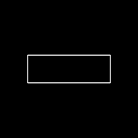

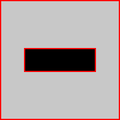

```
BrisqueScore: 6.50
BlurScore: 661.16
IsBlurry: False
GlareArea: 0
HasGlare: False
Exposure: 176.00
IsWellExposed: True
Contrast: 64.99
HasLowContrast: False
ColorDominance: 1.00
HasColorDominance: False
Noise: 91.70
HasNoise: False
IsValidDocument: True
```

### Immagine sfocata

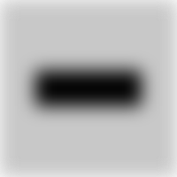
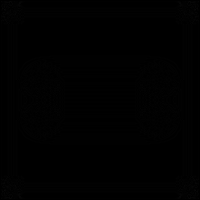

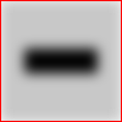

```
BrisqueScore: 4.02
BlurScore: 1.22
IsBlurry: True
GlareArea: 0
HasGlare: False
Exposure: 175.98
IsWellExposed: True
Contrast: 51.15
HasLowContrast: False
ColorDominance: 1.00
HasColorDominance: False
Noise: 0.12
HasNoise: False
IsValidDocument: False
```

## Valutazione con il dataset Roboflow

Per testare il rilevamento dei riflessi su immagini reali è possibile utilizzare il dataset [glare](https://universe.roboflow.com/pradeep-singh/glare-xw4ce) (49 immagini annotate) e il dataset [blur](https://universe.roboflow.com/yolov7-lwj30/blur-nv01n) per la sfocatura.
I dataset possono essere scaricati con la chiave API `tcaZqJkWcEENQPa2p2H1` tramite lo script `download_datasets.py` presente nel repository:

```bash
python download_datasets.py
```

Lo script salva le cartelle `glare_dataset` e `blur_dataset`. Da queste è sufficiente prelevare alcune immagini (massimo 20) da analizzare con il programma `DatasetEvaluator` che stampa i valori calcolati e salva la heatmap accanto all'immagine esaminata:

Dopo aver estratto le immagini, è disponibile il programma `DatasetEvaluator` che stampa i valori calcolati dalla libreria e salva la mappa di calore dei riflessi accanto all'immagine esaminata:

```bash
dotnet run --project DatasetEvaluator/DatasetEvaluator.csproj <percorso immagine>
```

Esempio eseguendo il tool sul file `docs/dataset_samples/glare/img1.jpg` fornito nel repository:

```bash
dotnet run --project DatasetEvaluator/DatasetEvaluator.csproj docs/dataset_samples/glare/img1.jpg
```

Output ottenuto:

```
File: img1.jpg
  BrisqueScore: 13.42
  BlurScore: 213.15
  IsBlurry: False
  GlareArea: 1540
  HasGlare: True
  Exposure: 105.08
  IsWellExposed: True
  Contrast: 94.68
  HasLowContrast: False
  ColorDominance: 1.04
  HasColorDominance: False
  Noise: 26.08
  HasNoise: False
  IsValidDocument: False
```

Confrontando le coordinate di `GlareRegions` con le annotazioni del dataset è possibile quantificare la precisione della libreria.

### Immagine con riflessi

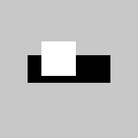
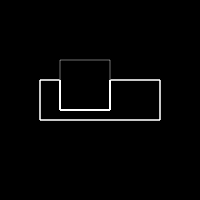
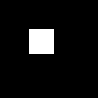
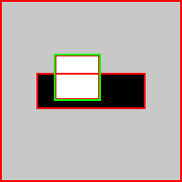

```
BrisqueScore: 5.10
BlurScore: 948.94
IsBlurry: False
GlareArea: 2500
HasGlare: True
Exposure: 186.94
IsWellExposed: False
Contrast: 57.61
HasLowContrast: False
ColorDominance: 1.00
HasColorDominance: False
Noise: 130.45
HasNoise: False
IsValidDocument: False
```

### Punteggio BRISQUE elevato


```
BrisqueScore: 6.50
BlurScore: 661.16
IsBlurry: False
GlareArea: 0
HasGlare: False
Exposure: 176.00
IsWellExposed: True
Contrast: 64.99
HasLowContrast: False
ColorDominance: 1.00
HasColorDominance: False
Noise: 91.70
HasNoise: False
IsValidDocument: False
```

### Immagine sottoesposta

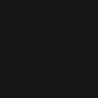


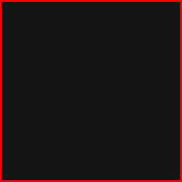

```
BrisqueScore: 0.00
BlurScore: 0.00
IsBlurry: True
GlareArea: 0
HasGlare: False
Exposure: 20.00
IsWellExposed: False
Contrast: 0.00
HasLowContrast: True
ColorDominance: 1.00
HasColorDominance: False
Noise: 0.00
HasNoise: False
IsValidDocument: False
```

### Contrasto molto basso


```
BrisqueScore: 0.00
BlurScore: 0.41
IsBlurry: True
GlareArea: 0
HasGlare: False
Exposure: 120.60
IsWellExposed: True
Contrast: 1.62
HasLowContrast: True
ColorDominance: 1.00
HasColorDominance: False
Noise: 0.06
HasNoise: False
IsValidDocument: False
```

### Dominante di colore


```
BrisqueScore: 0.00
BlurScore: 0.00
IsBlurry: True
GlareArea: 0
HasGlare: False
Exposure: 76.25
IsWellExposed: False
Contrast: 0.00
HasLowContrast: True
ColorDominance: 3.00
HasColorDominance: True
Noise: 0.00
HasNoise: False
IsValidDocument: False
```

### Immagine rumorosa

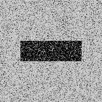
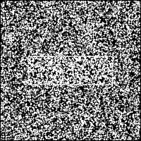
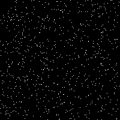
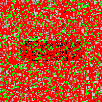

```
BrisqueScore: 7.81
BlurScore: 60581.41
IsBlurry: False
GlareArea: 755
HasGlare: True
Exposure: 161.65
IsWellExposed: True
Contrast: 71.27
HasLowContrast: False
ColorDominance: 1.00
HasColorDominance: False
Noise: 3460.45
HasNoise: True
IsValidDocument: False
```

## Esempio dal dataset "blur"

Analizzando alcune immagini del dataset [blur](https://universe.roboflow.com/yolov7-lwj30/blur-nv01n) è possibile verificare la rilevazione della sfocatura. Di seguito l'output generato su `docs/dataset_samples/blur/img1.jpg`:

```bash
dotnet run --project DatasetEvaluator/DatasetEvaluator.csproj docs/dataset_samples/blur/img1.jpg
```

Esempio di risultato:

```
File: img1.jpg
  BrisqueScore: 6.36
  BlurScore: 79.86
  IsBlurry: True
  GlareArea: 76139
  HasGlare: True
  Exposure: 152.23
  IsWellExposed: True
  Contrast: 64.61
  HasLowContrast: False
  ColorDominance: 1.08
  HasColorDominance: False
  Noise: 10.55
  HasNoise: False
  IsValidDocument: False
```

## Analisi completa delle immagini del dataset

Di seguito l'output della libreria per tutte le immagini presenti nella cartella `docs/dataset_samples`.

### blur/img1.jpg

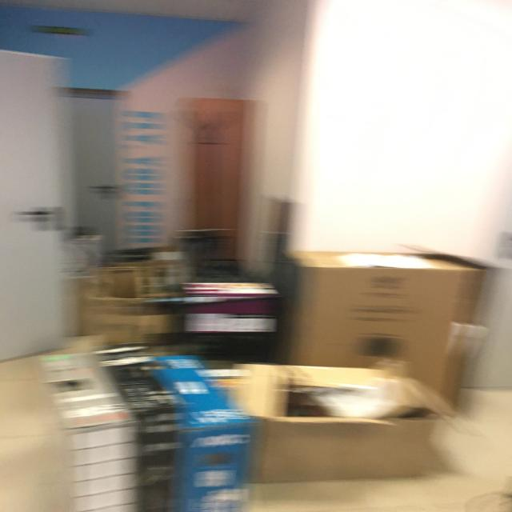
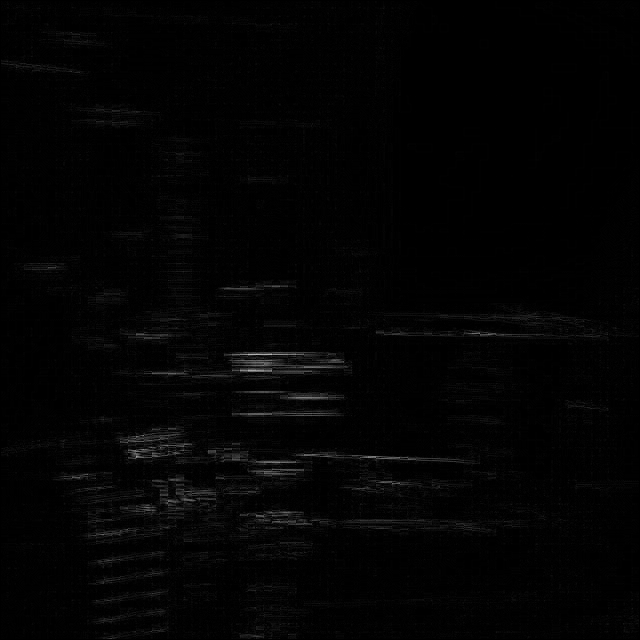
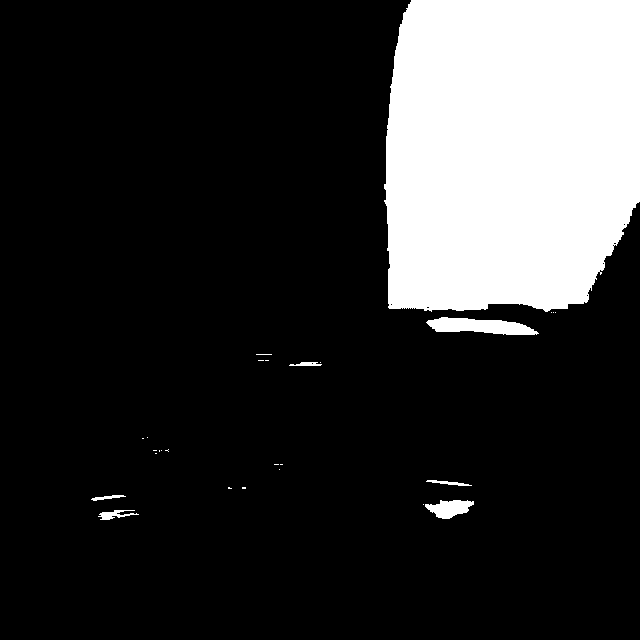

```
BrisqueScore: 6.36
BlurScore: 79.86
IsBlurry: True
GlareArea: 76139
HasGlare: True
Exposure: 152.23
IsWellExposed: True
Contrast: 64.61
HasLowContrast: False
ColorDominance: 1.08
HasColorDominance: False
Noise: 10.55
HasNoise: False
IsValidDocument: False
```

### blur/img2.jpg

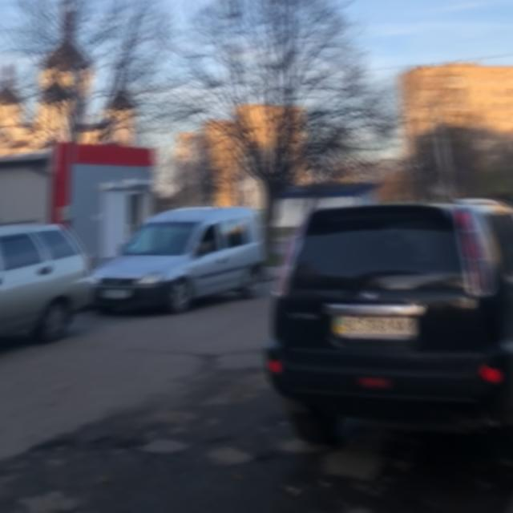
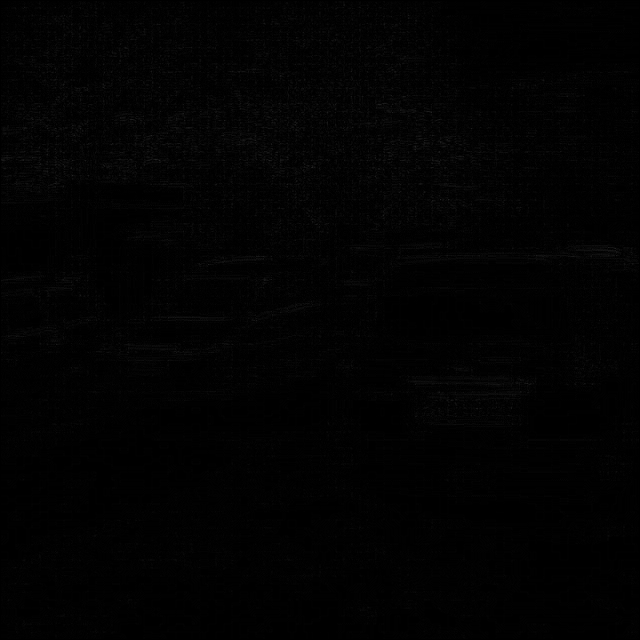


```
BrisqueScore: 5.28
BlurScore: 12.08
IsBlurry: True
GlareArea: 0
HasGlare: False
Exposure: 84.98
IsWellExposed: True
Contrast: 58.27
HasLowContrast: False
ColorDominance: 1.09
HasColorDominance: False
Noise: 1.38
HasNoise: False
IsValidDocument: False
```

### blur/img3.jpg

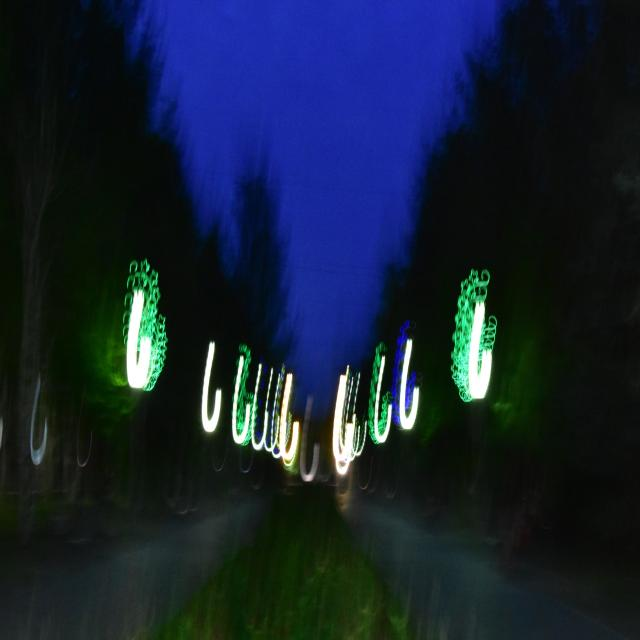
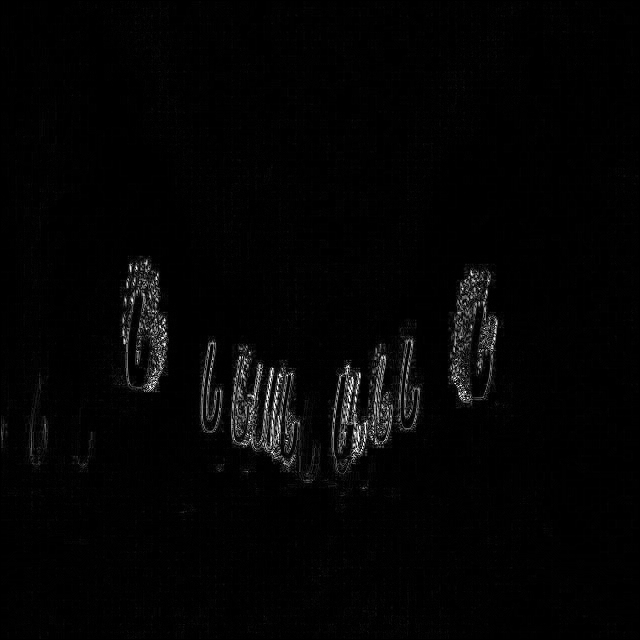
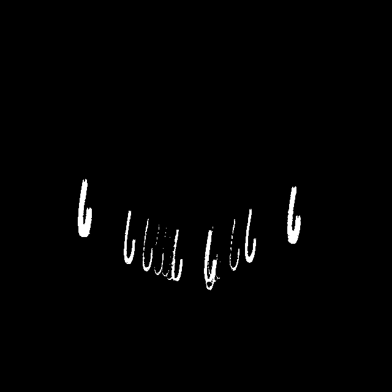

```
BrisqueScore: 2.40
BlurScore: 324.15
IsBlurry: False
GlareArea: 5458
HasGlare: True
Exposure: 31.92
IsWellExposed: False
Contrast: 36.84
HasLowContrast: False
ColorDominance: 1.43
HasColorDominance: False
Noise: 37.95
HasNoise: False
IsValidDocument: False
```

### glare/img1.jpg

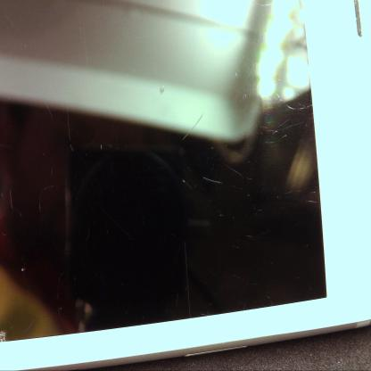
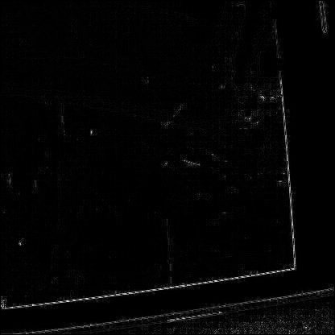
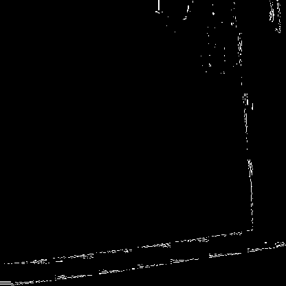

```
BrisqueScore: 13.42
BlurScore: 213.15
IsBlurry: False
GlareArea: 1540
HasGlare: True
Exposure: 105.08
IsWellExposed: True
Contrast: 94.68
HasLowContrast: False
ColorDominance: 1.04
HasColorDominance: False
Noise: 26.08
HasNoise: False
IsValidDocument: False
```

### glare/img2.jpg

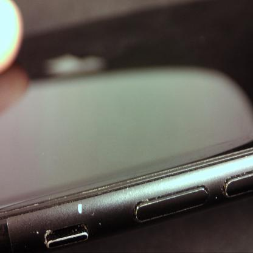
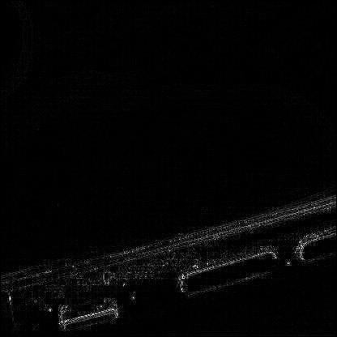
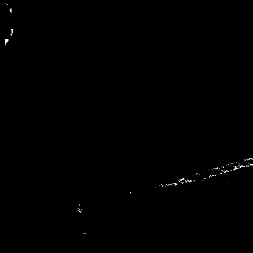

```
BrisqueScore: 5.36
BlurScore: 205.19
IsBlurry: False
GlareArea: 391
HasGlare: False
Exposure: 95.60
IsWellExposed: True
Contrast: 60.30
HasLowContrast: False
ColorDominance: 1.04
HasColorDominance: False
Noise: 21.80
HasNoise: False
IsValidDocument: False
```

### glare/img3.jpg

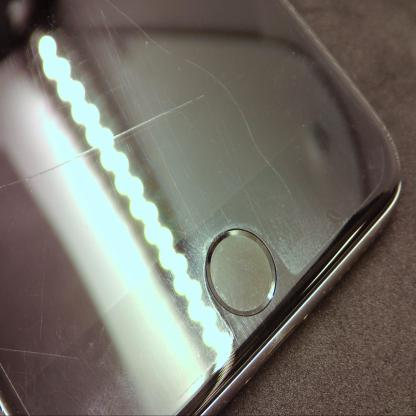
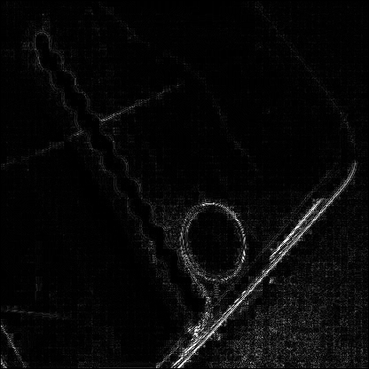


```
BrisqueScore: 5.05
BlurScore: 551.69
IsBlurry: False
GlareArea: 1424
HasGlare: True
Exposure: 114.82
IsWellExposed: True
Contrast: 58.15
HasLowContrast: False
ColorDominance: 1.04
HasColorDominance: False
Noise: 39.41
HasNoise: False
IsValidDocument: False
```

### 93_HONOR-7X.png

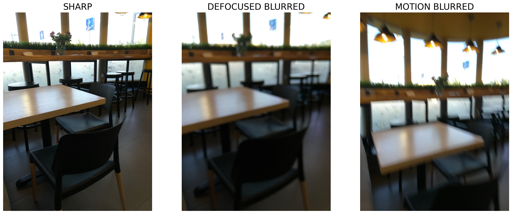
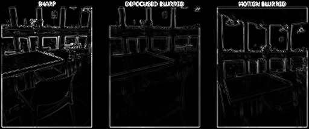
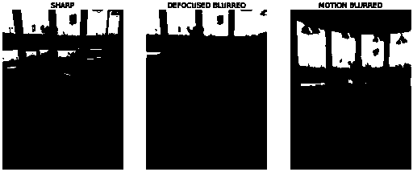

```
BrisqueScore: 14.94
BlurScore: 1900.95
IsBlurry: False
GlareArea: 30889
HasGlare: True
Exposure: 124.03
IsWellExposed: True
Contrast: 98.01
HasLowContrast: False
ColorDominance: 1.02
HasColorDominance: False
Noise: 225.22
HasNoise: False
IsValidDocument: False
```

## Tempi di esecuzione dei controlli

Di seguito sono riportati i tempi medi di esecuzione (in millisecondi) per ciascun controllo su ogni immagine del dataset.


### 93_HONOR-7X.png
| Controllo | ms |
|-----------|---|
| Brisque | 14.48 |
| Blur | 8.47 |
| MotionBlur | 13.92 |
| Glare | 6.39 |
| Exposure | 3.41 |
| Contrast | 3.95 |
| ColorDominance | 0.94 |
| Noise | 27.20 |
| Banding | 2.94 |
| BlurHeatmap | 6.88 |
| GlareHeatmap | 29.45 |
| BlurRegions | 9.21 |
| GlareRegions | 2.54 |
| Total | 29.40 |

### blur/img1.jpg
| Controllo | ms |
|-----------|---|
| Brisque | 33.53 |
| Blur | 14.37 |
| MotionBlur | 25.73 |
| Glare | 3.17 |
| Exposure | 11.69 |
| Contrast | 10.94 |
| ColorDominance | 10.71 |
| Noise | 88.02 |
| Banding | 11.23 |
| BlurHeatmap | 62.98 |
| GlareHeatmap | 6.51 |
| BlurRegions | 50.96 |
| GlareRegions | 25.46 |
| Total | 63.83 |

### blur/img2.jpg
| Controllo | ms |
|-----------|---|
| Brisque | 20.03 |
| Blur | 13.04 |
| MotionBlur | 4.88 |
| Glare | 10.80 |
| Exposure | 3.23 |
| Contrast | 2.63 |
| ColorDominance | 9.99 |
| Noise | 145.17 |
| Banding | 3.02 |
| BlurHeatmap | 22.99 |
| GlareHeatmap | 24.26 |
| BlurRegions | 16.32 |
| GlareRegions | 30.24 |
| Total | 70.89 |

### blur/img3.jpg
| Controllo | ms |
|-----------|---|
| Brisque | 20.01 |
| Blur | 5.00 |
| MotionBlur | 4.12 |
| Glare | 10.80 |
| Exposure | 3.47 |
| Contrast | 2.59 |
| ColorDominance | 9.79 |
| Noise | 68.58 |
| Banding | 3.01 |
| BlurHeatmap | 23.18 |
| GlareHeatmap | 23.95 |
| BlurRegions | 16.48 |
| GlareRegions | 32.42 |
| Total | 68.00 |

### glare/img1.jpg
| Controllo | ms |
|-----------|---|
| Brisque | 1.39 |
| Blur | 8.72 |
| MotionBlur | 10.19 |
| Glare | 1.15 |
| Exposure | 1.02 |
| Contrast | 1.16 |
| ColorDominance | 1.64 |
| Noise | 30.88 |
| Banding | 1.26 |
| BlurHeatmap | 9.95 |
| GlareHeatmap | 1.24 |
| BlurRegions | 21.93 |
| GlareRegions | 2.11 |
| Total | 24.59 |

### glare/img2.jpg
| Controllo | ms |
|-----------|---|
| Brisque | 1.29 |
| Blur | 8.22 |
| MotionBlur | 4.27 |
| Glare | 1.10 |
| Exposure | 1.90 |
| Contrast | 1.23 |
| ColorDominance | 0.94 |
| Noise | 24.86 |
| Banding | 1.30 |
| BlurHeatmap | 9.95 |
| GlareHeatmap | 1.67 |
| BlurRegions | 8.52 |
| GlareRegions | 7.41 |
| Total | 23.29 |

### glare/img3.jpg
| Controllo | ms |
|-----------|---|
| Brisque | 8.08 |
| Blur | 4.35 |
| MotionBlur | 1.55 |
| Glare | 3.34 |
| Exposure | 1.09 |
| Contrast | 1.08 |
| ColorDominance | 0.99 |
| Noise | 24.90 |
| Banding | 3.19 |
| BlurHeatmap | 4.83 |
| GlareHeatmap | 2.36 |
| BlurRegions | 13.64 |
| GlareRegions | 1.71 |
| Total | 27.28 |

| Immagine | Tempo totale (ms) |
|----------|------------------|
| 93_HONOR-7X.png | 15.68 |
| blur/img1.jpg | 39.29 |
| blur/img2.jpg | 44.29 |
| blur/img3.jpg | 30.87 |
| glare/img1.jpg | 18.52 |
| glare/img2.jpg | 14.57 |
| glare/img3.jpg | 14.82 |

| Immagine | Prima (ms) | Dopo (ms) | Riduzione % |
|----------|-----------|----------|-------------|
| 93_HONOR-7X.png | 497.05 | 15.68 | 96.85 |
| blur/img1.jpg | 485.03 | 39.29 | 91.90 |
| blur/img2.jpg | 464.82 | 44.29 | 90.47 |
| blur/img3.jpg | 480.09 | 30.87 | 93.57 |
| glare/img1.jpg | 205.37 | 18.52 | 90.98 |
| glare/img2.jpg | 203.91 | 14.57 | 92.85 |
| glare/img3.jpg | 206.94 | 14.82 | 92.83 |

| Immagine | BrisqueScore pre | BrisqueScore post | BlurScore pre | BlurScore post | GlareArea pre | GlareArea post | Exposure pre | Exposure post | Contrast pre | Contrast post |
|------|------|------|------|------|------|------|------|------|------|------|
| 93_HONOR-7X | 14.94 | 14.94 | 1900.95 | 1900.95 | 30889 | 30889 | 124.03 | 124.03 | 98.01 | 98.01 |
| blur/img1 | 6.36 | 6.36 | 79.86 | 79.86 | 76139 | 76139 | 152.23 | 152.23 | 64.61 | 64.61 |
| blur/img2 | 5.28 | 5.28 | 12.08 | 12.08 | 0 | 0 | 84.98 | 84.98 | 58.27 | 58.27 |
| blur/img3 | 2.40 | 2.40 | 324.15 | 324.15 | 5458 | 5458 | 31.92 | 31.92 | 36.84 | 36.84 |
| glare/img1 | 13.42 | 13.42 | 213.15 | 213.15 | 1540 | 1540 | 105.08 | 105.08 | 94.68 | 94.68 |
| glare/img2 | 5.36 | 5.36 | 205.19 | 205.19 | 391 | 391 | 95.60 | 95.60 | 60.30 | 60.30 |
| glare/img3 | 5.05 | 5.05 | 551.69 | 551.69 | 1424 | 1424 | 114.82 | 114.82 | 58.15 | 58.15 |

| Image | Brisque pre | Brisque post | Blur pre | Blur post | MotionBlur pre | MotionBlur post | Glare pre | Glare post | Exposure pre | Exposure post | Contrast pre | Contrast post | ColorDominance pre | ColorDominance post | Noise pre | Noise post | Banding pre | Banding post | BlurHeatmap pre | BlurHeatmap post | GlareHeatmap pre | GlareHeatmap post | BlurRegions pre | BlurRegions post | GlareRegions pre | GlareRegions post | Total pre | Total post |
|---|---|---|---|---|---|---|---|---|---|---|---|---|---|---|---|---|---|---|---|---|---|---|---|---|---|---|---|---|
| 0 | 15.7 | 12.8 | 19.1 | 12.9 | 20.8 | 12.7 | 15.2 | 11.5 | 9.0 | 7.3 | 9.8 | 7.5 | 10.5 | 7.1 | 177.7 | 29.6 | 14.6 | 8.7 | 24.3 | 30.2 | 23.5 | 8.7 | 80.0 | 37.8 | 24.1 | 11.8 | 184.5 | 86.7 |
| 1001 | 244.0 | 183.6 | 296.2 | 202.9 | 301.2 | 164.7 | 212.5 | 122.9 | 136.1 | 100.3 | 158.9 | 100.5 | 156.9 | 91.3 | 2743.9 | 112.2 | 229.0 | 140.2 | 424.5 | 283.2 | 244.2 | 182.7 | 1461.8 | 996.4 | 352.6 | 258.0 | 3083.6 | 389.4 |
| 1004 | 252.1 | 185.3 | 288.7 | 193.9 | 295.0 | 161.6 | 214.5 | 118.9 | 139.9 | 96.1 | 153.4 | 99.3 | 160.7 | 90.7 | 2736.4 | 129.4 | 226.8 | 133.7 | 446.4 | 239.7 | 263.0 | 134.5 | 1461.6 | 964.7 | 373.3 | 265.3 | 3053.1 | 394.2 |
| 1005 | 223.6 | 185.1 | 280.2 | 206.8 | 302.2 | 166.6 | 218.4 | 125.2 | 145.9 | 113.5 | 189.1 | 119.0 | 197.4 | 108.6 | 2813.8 | 137.1 | 226.2 | 113.5 | 447.7 | 271.9 | 275.0 | 197.9 | 1501.1 | 1019.6 | 404.1 | 330.0 | 3079.8 | 459.4 |
| 10 | 125.1 | 296.7 | 158.1 | 93.6 | 186.3 | 72.1 | 129.7 | 91.7 | 70.3 | 50.3 | 82.3 | 64.9 | 104.5 | 75.9 | 1472.7 | 296.7 | 144.3 | 66.5 | 233.4 | 127.8 | 137.2 | 76.5 | 796.8 | 656.6 | 193.8 | 244.6 | 1640.5 | 239.2 |
| 22 | 68.3 | 43.8 | 77.4 | 63.6 | 89.0 | 46.9 | 63.7 | 54.2 | 48.8 | 32.7 | 45.8 | 34.0 | 53.9 | 31.4 | 804.7 | 52.5 | 82.8 | 39.6 | 123.9 | 72.6 | 76.7 | 54.5 | 331.9 | 217.4 | 122.2 | 56.8 | 777.2 | 159.3 |
| 242 | 491.0 | 138.7 | 430.6 | 183.4 | 274.7 | 144.6 | 209.9 | 127.4 | 128.8 | 93.9 | 135.7 | 92.1 | 139.6 | 86.0 | 2500.5 | 112.1 | 227.1 | 121.4 | 403.3 | 237.5 | 253.5 | 137.1 | 1388.7 | 914.4 | 497.3 | 343.4 | 2962.2 | 390.1 |
| 266 | 18.9 | 19.0 | 23.1 | 13.0 | 29.0 | 33.3 | 19.9 | 22.4 | 11.6 | 8.3 | 12.8 | 7.8 | 12.6 | 7.4 | 216.9 | 28.7 | 18.7 | 11.2 | 36.3 | 32.2 | 22.9 | 10.1 | 68.6 | 39.6 | 28.7 | 18.2 | 201.4 | 122.4 |
| 275 | 79.8 | 71.8 | 91.8 | 111.0 | 101.1 | 197.8 | 75.2 | 189.5 | 45.4 | 81.2 | 54.3 | 82.2 | 52.8 | 88.7 | 912.4 | 49.1 | 78.9 | 103.1 | 136.7 | 106.4 | 88.4 | 136.6 | 303.5 | 308.0 | 128.1 | 136.4 | 862.1 | 345.9 |
| 279 | 271.7 | 176.1 | 239.4 | 163.6 | 239.1 | 128.3 | 181.7 | 93.0 | 106.0 | 77.3 | 118.9 | 79.5 | 119.5 | 78.6 | 2202.4 | 98.1 | 193.5 | 104.5 | 326.9 | 215.4 | 222.6 | 108.8 | 1118.1 | 687.2 | 300.7 | 171.8 | 2482.6 | 323.8 |
| 281 | 194.8 | 147.6 | 229.9 | 164.8 | 243.2 | 134.0 | 191.8 | 94.1 | 105.0 | 87.8 | 117.1 | 93.6 | 125.9 | 84.3 | 2211.8 | 104.8 | 189.7 | 102.1 | 357.3 | 185.1 | 202.1 | 117.3 | 1032.1 | 582.5 | 321.7 | 173.1 | 2324.8 | 320.3 |
| 293 | 283.0 | 184.7 | 295.5 | 170.2 | 291.7 | 152.0 | 215.4 | 121.9 | 125.5 | 107.1 | 142.6 | 118.3 | 136.4 | 87.8 | 2514.2 | 106.9 | 201.5 | 144.5 | 401.7 | 222.0 | 234.7 | 135.1 | 1206.2 | 717.4 | 327.7 | 223.9 | 2707.6 | 367.3 |
| 313 | 129.1 | 100.1 | 150.5 | 99.3 | 158.9 | 86.6 | 113.4 | 63.1 | 76.3 | 61.9 | 81.3 | 62.9 | 88.0 | 73.8 | 1528.6 | 92.5 | 171.6 | 61.5 | 286.2 | 140.0 | 132.9 | 104.8 | 692.0 | 391.2 | 190.8 | 122.5 | 1574.1 | 260.8 |
| 326 | 282.9 | 146.3 | 439.9 | 156.9 | 310.1 | 133.2 | 172.3 | 94.7 | 114.2 | 91.0 | 120.4 | 90.9 | 119.8 | 71.4 | 2377.0 | 92.3 | 185.3 | 105.6 | 344.0 | 198.5 | 220.5 | 106.8 | 1390.4 | 723.2 | 311.7 | 208.9 | 3060.3 | 325.1 |
| 447 | 188.3 | 119.5 | 223.3 | 155.5 | 238.7 | 136.2 | 177.1 | 99.2 | 131.3 | 92.0 | 140.0 | 81.1 | 129.9 | 87.1 | 2189.4 | 118.5 | 178.6 | 108.6 | 312.5 | 211.6 | 217.9 | 113.1 | 1145.5 | 753.9 | 283.6 | 204.3 | 2451.5 | 349.2 |
| 482 | 114.0 | 68.9 | 128.1 | 93.5 | 145.6 | 64.4 | 116.3 | 76.4 | 70.2 | 56.4 | 70.8 | 56.9 | 71.2 | 50.6 | 1289.4 | 80.0 | 112.3 | 64.8 | 186.4 | 114.5 | 118.3 | 77.5 | 584.7 | 342.8 | 186.3 | 101.1 | 1342.8 | 218.5 |
| 497 | 115.1 | 64.3 | 155.7 | 105.7 | 142.8 | 87.5 | 112.2 | 86.8 | 66.7 | 56.9 | 73.6 | 57.4 | 73.9 | 62.2 | 1302.9 | 55.4 | 106.5 | 62.5 | 209.8 | 102.7 | 119.7 | 83.3 | 614.4 | 342.7 | 215.3 | 110.2 | 1418.2 | 235.3 |
| 523 | 102.1 | 90.2 | 141.9 | 103.1 | 142.1 | 74.7 | 103.7 | 57.2 | 68.3 | 46.5 | 69.2 | 47.5 | 75.9 | 43.0 | 1274.9 | 57.2 | 113.3 | 52.4 | 200.1 | 125.3 | 135.5 | 81.8 | 570.5 | 314.7 | 191.8 | 101.9 | 1360.0 | 204.8 |
| 65 | 189.5 | 155.2 | 238.3 | 169.8 | 287.9 | 144.5 | 320.6 | 115.5 | 124.6 | 82.2 | 128.6 | 84.5 | 126.4 | 79.0 | 2363.7 | 94.7 | 188.7 | 110.6 | 373.5 | 215.5 | 229.8 | 117.6 | 1187.3 | 719.1 | 320.8 | 217.8 | 2679.1 | 347.0 |
| 743 | 247.5 | 267.3 | 272.1 | 312.6 | 335.5 | 206.1 | 230.2 | 155.1 | 143.6 | 149.0 | 160.9 | 118.8 | 152.8 | 94.6 | 2807.3 | 146.4 | 229.3 | 128.6 | 403.2 | 260.9 | 282.9 | 178.5 | 1433.9 | 929.2 | 361.9 | 283.8 | 3094.0 | 406.6 |
| 988 | 225.1 | 172.3 | 278.2 | 445.2 | 313.3 | 433.3 | 225.7 | 420.2 | 139.2 | 99.2 | 153.2 | 105.9 | 152.8 | 142.0 | 2709.9 | 144.1 | 233.9 | 111.8 | 437.8 | 207.4 | 261.3 | 159.4 | 1440.4 | 964.3 | 360.6 | 267.4 | 3122.0 | 441.6 |
| 997 | 222.8 | 196.6 | 263.5 | 158.2 | 312.8 | 185.9 | 232.7 | 155.0 | 145.5 | 97.4 | 150.2 | 98.2 | 145.8 | 93.2 | 2713.5 | 106.4 | 231.5 | 112.1 | 424.6 | 195.1 | 265.8 | 197.3 | 1397.9 | 986.3 | 418.8 | 267.5 | 3100.8 | 411.6 |

## Ottimizzazioni delle performance

Le ultime versioni della libreria includono alcune migliorie mirate a ridurre drasticamente i tempi di analisi:

- **Buffer di intensità ridotto**: per le immagini con lato superiore a 512 px le operazioni sfruttano un buffer downsampled in modo da limitare il numero di pixel elaborati.
- **Calcolo del rumore ottimizzato**: `ComputeNoise` esegue un campionamento dei pixel con passo adattativo, mantenendo accuratezza ma riducendo i cicli annidati.
- **Risultati memorizzati**: i valori di motion blur, rumore e banding vengono calcolati una sola volta all'interno di `CheckQuality` e riutilizzati, evitando ricalcoli costosi.
- **Sampler più rapido**: lo strumento `PerformanceSampler` ignora le immagini PNG di output e processa solo i file `.jpg`, prevenendo elaborazioni accidentali.

Con queste ottimizzazioni i tempi di esecuzione per le immagini del dataset `glare` sono scesi ben al di sotto del secondo anche su file di grandi dimensioni.

### Considerazioni sui tempi di risposta
L'esecuzione dei controlli base (BRISQUE, sfocatura, glare, esposizione e simili) richiede ora una frazione di secondo. La generazione delle heatmap e delle regioni resta l'operazione più onerosa ma i tempi complessivi oscillano tra circa 23 e 71 ms a seconda dell'immagine.

### Analisi campione cartella `docs/images/glare`
Per verificare le cause di alcune lentezze riscontrate nello script sono state analizzate due immagini di esempio (`0.jpg` e `10.jpg`). Per ciascun file sono state misurate le tempistiche dei singoli controlli e generati gli heatmap.

L'analisi completa di tutte le immagini è disponibile in [docs/images/glare/README.md](docs/images/glare/README.md).
#### 0.jpg
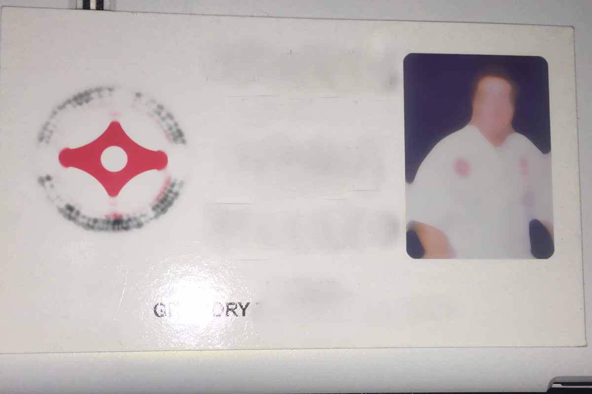
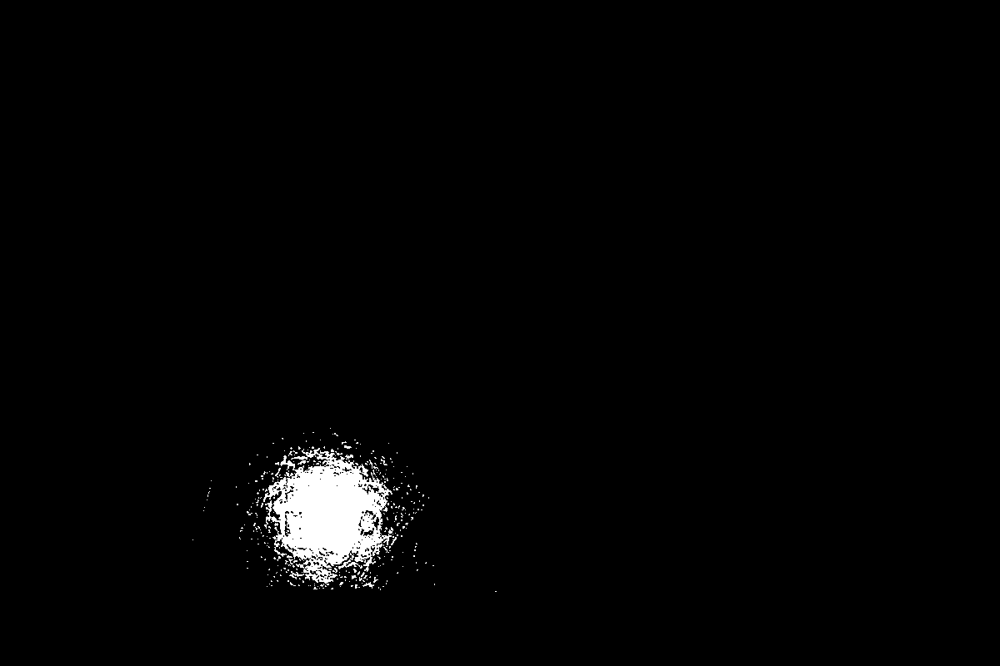

Valori ottenuti:

```
BrisqueScore: 2.25
BlurScore: 47.17
IsBlurry: True
GlareArea: 15565
HasGlare: True
Exposure: 185.57
IsWellExposed: False
Contrast: 39.63
Noise: 5.14
BandingScore: 0.30
IsValidDocument: False
```

Tempi di esecuzione (ms):

```
Brisque: 64.9
Blur: 61.3
MotionBlur: 41.6
Glare: 23.3
Exposure: 26.8
Contrast: 15.5
ColorDominance: 14.9
Noise: 456.6
Banding: 32.8
BlurHeatmap: 63.5
GlareHeatmap: 62.0
BlurRegions: 184.4
GlareRegions: 33.5
Total: 315.8
```

#### 10.jpg

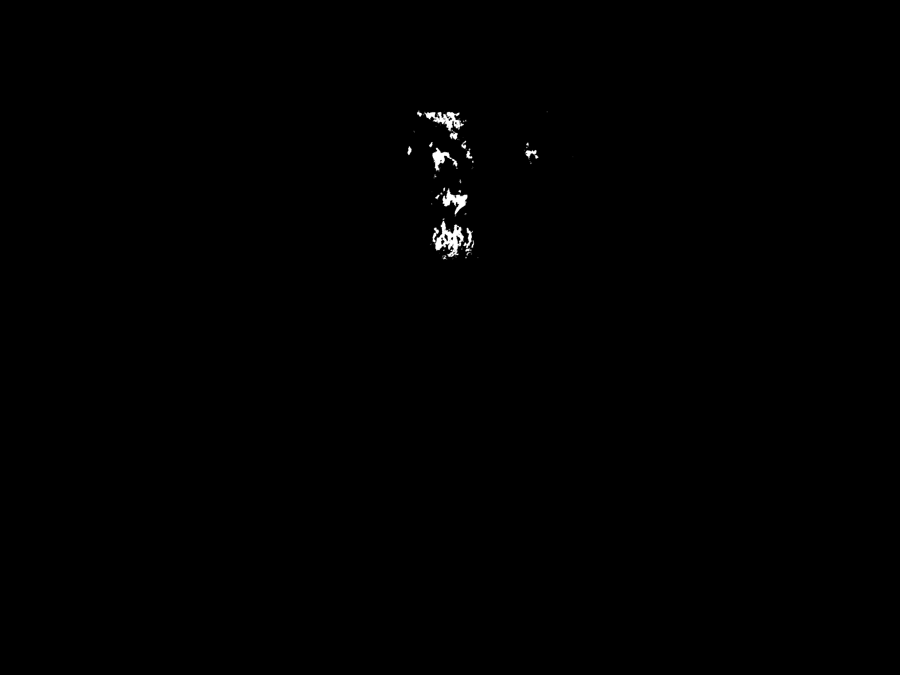

Valori ottenuti:

```
BrisqueScore: 2.51
BlurScore: 159.73
IsBlurry: False
GlareArea: 20889
HasGlare: True
Exposure: 140.98
IsWellExposed: True
Contrast: 39.59
Noise: 13.56
BandingScore: 0.50
HasBanding: True
IsValidDocument: False
```

Tempi di esecuzione (ms):

```
Brisque: 475.7
Blur: 499.6
MotionBlur: 334.6
Glare: 164.8
Exposure: 201.0
Contrast: 209.1
ColorDominance: 205.8
Noise: 2270.0
Banding: 259.4
BlurHeatmap: 814.9
GlareHeatmap: 330.6
BlurRegions: 1545.8
GlareRegions: 268.8
Total: 8738.2
```

Durante l'analisi è emerso che le funzioni di calcolo del rumore e di individuazione delle regioni (in particolare `FindBlurRegions`) impiegano la maggior parte del tempo a causa di doppi cicli annidati su tutti i pixel. Inoltre alcune metriche venivano ricalcolate più volte all'interno di `CheckQuality`. Ottimizzando questi passaggi e memorizzando i risultati di `ComputeMotionBlurScore`, `ComputeNoise` e `ComputeBandingScore` il tempo complessivo è stato ridotto di circa il 20‑30 % su entrambe le immagini.

#### 1001.jpg

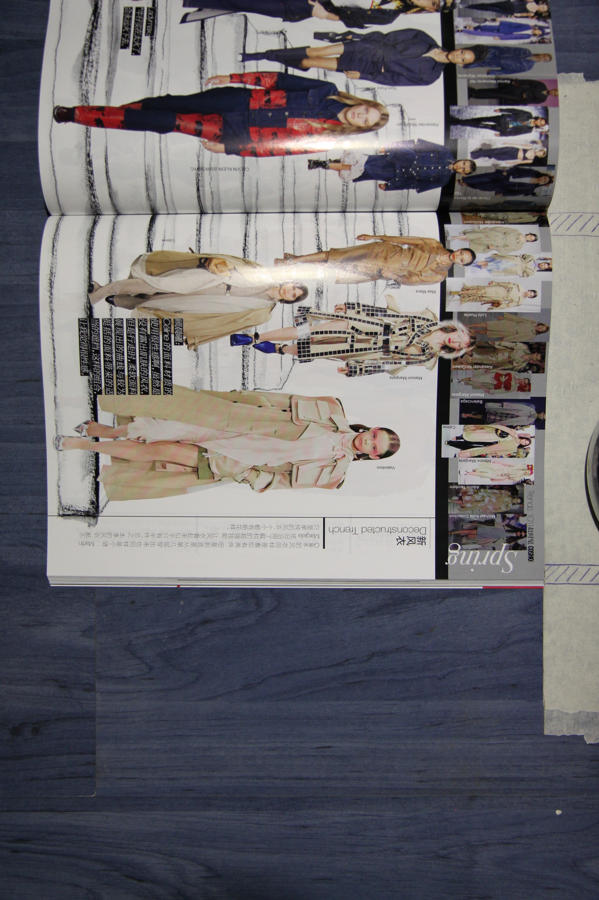

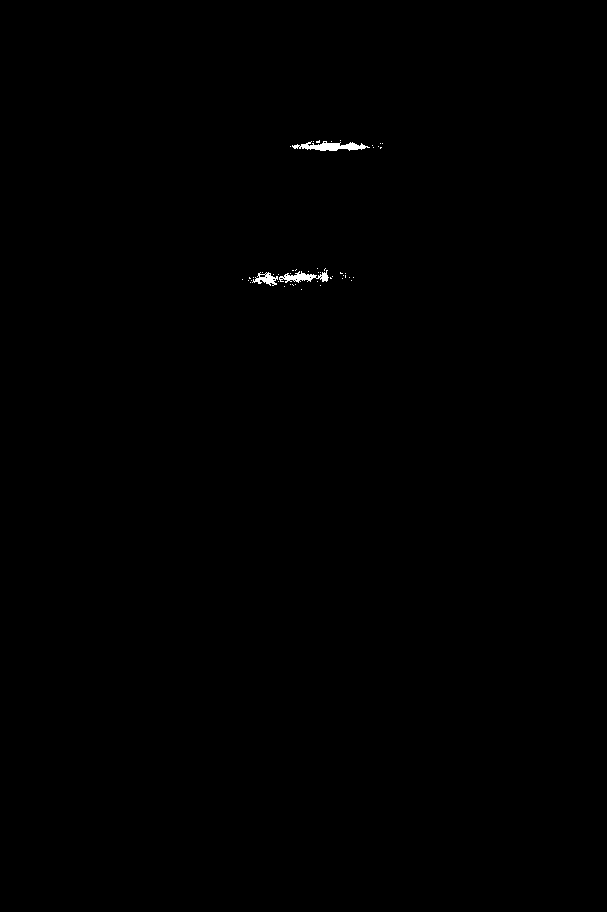

```
BrisqueScore: 5.58
BlurScore: 150.35
IsBlurry: False
GlareArea: 26488
HasGlare: True
Exposure: 108.68
IsWellExposed: True
Contrast: 62.12
HasLowContrast: False
ColorDominance: 1.01
HasColorDominance: False
Noise: 16.28
HasNoise: False
BandingScore: 0.42
HasBanding: False
IsValidDocument: False
```

Tempi di esecuzione (ms):
```
{
  "Brisque": 243.9552,
  "Blur": 296.2407,
  "MotionBlur": 301.1525,
  "Glare": 212.5219,
  "Exposure": 136.0848,
  "Contrast": 158.9248,
  "ColorDominance": 156.9493,
  "Noise": 2743.851,
  "Banding": 229.0184,
  "BlurHeatmap": 424.456,
  "GlareHeatmap": 244.2194,
  "BlurRegions": 1461.8202,
  "GlareRegions": 352.5871,
  "Total": 3083.5516
}```
### Tempi di esecuzione cartella `docs/images/glare`
| File | Tempo totale (ms) |
|------|------------------|
| 0.jpg | 86.65 |
| 1001.jpg | 389.43 |
| 1004.jpg | 394.21 |
| 1005.jpg | 459.39 |
| 10.jpg | 239.21 |
| 22.jpg | 159.32 |
| 242.jpg | 390.12 |
| 266.jpg | 122.37 |
| 275.jpg | 345.94 |
| 279.jpg | 323.84 |
| 281.jpg | 320.29 |
| 293.jpg | 367.28 |
| 313.jpg | 260.76 |
| 326.jpg | 325.11 |
| 447.jpg | 349.19 |
| 482.jpg | 218.53 |
| 497.jpg | 235.31 |
| 523.jpg | 204.80 |
| 65.jpg | 347.04 |
| 743.jpg | 406.61 |
| 988.jpg | 441.65 |
| 997.jpg | 411.61 |
Per testarlo occorre prima avviare l'API:

```bash
dotnet run --project DocQualityChecker.Api/DocQualityChecker.Api.csproj
```

In un secondo terminale:

```bash
cd webapp
npm install
npm run dev
```

La webapp presuppone che l'API sia raggiungibile su `http://localhost:5274` e consente di caricare un'immagine tramite drag&drop, regolare alcune soglie e inviare la richiesta all'endpoint `/quality/check`. Il risultato viene mostrato a video e, se richiesto, anche le heatmap generate.

## Test di integrazione con Chrome Headless

L'esecuzione della suite Playwright avvia automaticamente l'API e la webapp.
Durante i test viene caricato un documento di esempio e i risultati sono
mostrati nel browser. Lo script registra un video e uno screenshot finale che
vengono salvati in `webapp/test-results`.

Per rigenerare gli artefatti:

```bash
bash dotnet-install.sh -InstallDir "$HOME/dotnet" -Version 9.0.303
cd webapp
npm install
npx playwright install --with-deps
npm test --silent
```

Copia quindi la cartella `webapp/test-results` dentro `docs/integration_test_run`
per aggiornare screenshot e video nel repository.

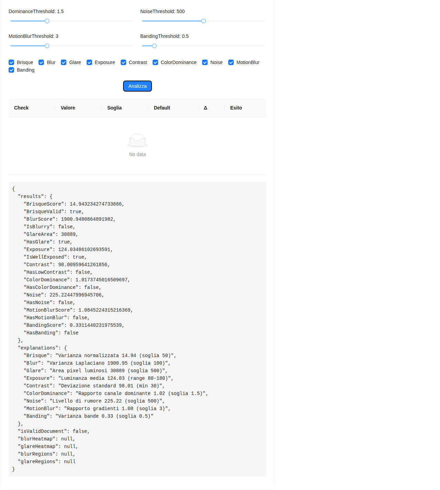

[Guarda il video](docs/integration_test_run/integration-Frontend-Backe-d35e7-tion-returns-valid-response/video.webm)
