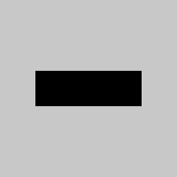
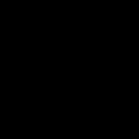

# Image Quality Scanner

Questa libreria fornisce semplici controlli di qualità su immagini di documenti tramite API gestite.
L'implementazione utilizza [SkiaSharp](https://github.com/mono/SkiaSharp) per la manipolazione delle immagini.
È inoltre possibile analizzare documenti **PDF** grazie alla libreria [PDFtoImage](https://www.nuget.org/packages/PDFtoImage). Il metodo `CheckQuality(Stream, QualitySettings, int? pageIndex)` elabora la singola pagina indicata o, in assenza di parametro, tutte le pagine del file.

## Requisiti

 - .NET 9 SDK

Le dipendenze NuGet vengono ripristinate automaticamente durante la fase di build/test.


## Quick .NET smoke-test

```bash
# Esegue la verifica sulle immagini di esempio incluse nel repository
dotnet run --project DocQualitySmoke -- --sample docs/dataset_samples/sample_paths.txt --outDir docs/dataset_samples
```

Esempio di output:

```
Metric,PassRate,Mean,Std,Min,Max
IsBlurry,0.7142857142857143,,,,
HasGlare,0.2857142857142857,,,,
HasNoise,1,,,,
HasLowContrast,1,,,,
HasColorDominance,1,,,,
!IsWellExposed,0.8571428571428571,,,,
BlurScore,,469.5819390324641,606.3415857057887,12.083860439875183,1900.9480864891982
MotionBlurScore,,1.6441650588457253,0.3958955466749499,1.0845224315216333,2.137096895459947
GlareArea,,16548.714285714286,26372.604972987112,0,76139
Exposure,,101.23882303584115,34.68380465029075,31.917161313477436,152.2304183349869
Contrast,,67.26729606314137,20.149811660004996,36.84231229212407,98.00959641261856
Noise,,51.77051048588495,71.93903769019506,1.3806768919125847,225.22447996952982
ColorDominance,,1.1064445543082895,0.1356355749016192,1.0173745016509697,1.4340195181818864
BandingScore,,0.4239158740468216,0.15385741277968495,0.23885059549006077,0.737141010482198
BrisqueScore,,7.544447107577828,4.363001807733202,2.400555034423491,14.943234274733666
AvgProcessingTimeMs,,55.1192,,,
```


## Controlli di qualità
La classe `DocumentQualityChecker` esegue diversi controlli sull'immagine:

### BrisqueScore
Il BRISQUE (Blind/Referenceless Image Spatial Quality Evaluator) è un indice di qualità senza riferimento. In questa implementazione semplificata il punteggio è calcolato dalla varianza dei livelli di intensità e viene normalizzato tra 0 (immagine ideale) e 100 (scarsa qualità). Il valore ottimale è **inferiore a 50** (impostazione `BrisqueMax`).

### IsBlurry
Verifica la nitidezza calcolando la varianza del filtro Laplaciano. Restituisce un punteggio numerico e un booleano. Valori maggiori di **100** indicano un'immagine nitida; valori inferiori la rendono sfocata (`BlurThreshold`).

### HasGlare
Conta i pixel con intensità oltre **240** e verifica che l'area sia minore di **500** pixel. Se l'area luminosa supera la soglia (`AreaThreshold`) l'immagine contiene riflessi.

### Esposizione
Calcola la luminanza media usando la formula `0.299R + 0.587G + 0.114B` e verifica che sia compresa tra `ExposureMin` e `ExposureMax` (80-180 di default).

### Contrasto
Analizza la deviazione standard della luminanza. Valori inferiori a `ContrastMin` (30) indicano un contrasto insufficiente.

### Dominanza colore
Verifica se un canale RGB domina sugli altri calcolando il rapporto tra il canale più elevato e la media. Se il rapporto supera `DominanceThreshold` (1.5) l'immagine presenta una dominante.

### Rumore
Stima il rumore confrontando ogni pixel con la media dei vicini. Se il valore supera `NoiseThreshold` (20) il disturbo è considerato eccessivo.

### Motion blur
Calcola il rapporto tra le variazioni orizzontali e verticali dei pixel. Valori molto distanti da 1 indicano una sfocatura dovuta al movimento (`MotionBlurThreshold`).

### Bande orizzontali/verticali
Misura la varianza delle medie di righe e colonne per rilevare la presenza di bande uniformi. Un punteggio elevato (oltre `BandingThreshold`) segnala possibili difetti di scansione.

### CheckQuality
Combina i controlli precedenti usando le soglie definite in `QualitySettings` e restituisce un `DocumentQualityResult` con tutti i valori ottenuti.

Le soglie sono configurabili tramite l'oggetto `QualitySettings`. Impostando `GenerateHeatmaps` a `true` è inoltre possibile ottenere due bitmap (`BlurHeatmap` e `GlareHeatmap`) che evidenziano rispettivamente le zone sfocate e quelle colpite da riflessi. Nello stesso modo vengono calcolate anche le coordinate di tali aree tramite le liste `BlurRegions` e `GlareRegions` restituite nel `DocumentQualityResult`.

## Parametri configurabili
La classe `QualitySettings` consente di personalizzare le soglie utilizzate nei vari controlli. Nella tabella seguente sono riportati tutti i parametri disponibili, con i valori di default e alcune indicazioni su come regolarli a seconda delle esigenze:

| Proprietà | Descrizione | Valore predefinito | Note sull'utilizzo |
|-----------|-------------|--------------------|--------------------|
| `BrisqueMax` | Valore massimo accettabile del punteggio BRISQUE. | `50.0` | Ridurre il valore per richiedere una qualità più elevata, aumentarlo per essere meno restrittivi. |
| `BlurThreshold` | Soglia sulla varianza del Laplaciano sotto la quale l'immagine è considerata sfocata. | `100.0` | Se le immagini risultano troppo frequentemente "blurry" è possibile abbassare la soglia. |
| `BrightThreshold` | Intensità (0-255) oltre la quale un pixel è considerato riflesso. | `240` | Valori più alti evitano falsi positivi in condizioni luminose. |
| `AreaThreshold` | Numero minimo di pixel luminosi per dichiarare la presenza di glare. | `500` | Diminuire se si vogliono individuare anche riflessi di piccole dimensioni. |
| `ExposureMin` | Luminanza media minima accettabile. | `80.0` | Aumentare se le immagini tendono ad essere troppo scure. |
| `ExposureMax` | Luminanza media massima accettabile. | `180.0` | Ridurre se le immagini sono spesso sovraesposte. |
| `ContrastMin` | Deviazione standard minima della luminanza per considerare sufficiente il contrasto. | `30.0` | Alzare la soglia richiede un contrasto maggiore. |
| `DominanceThreshold` | Rapporto massimo tra il canale dominante e la media degli altri due. | `1.5` | Ridurre se è necessario rilevare anche dominanti cromatiche leggere. |
| `NoiseThreshold` | Livello massimo di rumore ammesso. | `500.0` | Diminuire per ottenere immagini molto pulite, aumentare se il rumore non è un problema. |
| `MotionBlurThreshold` | Rapporto massimo tra gradienti orizzontali e verticali prima di considerare il movimento. | `3.0` | Valori più bassi rendono il controllo più severo. |
| `BandingThreshold` | Soglia sul rapporto di varianza delle righe/colonne per individuare bande. | `0.5` | Aumentare se si vogliono rilevare solo bande marcate. |
| `GenerateHeatmaps` | Se `true` produce le mappe di calore e le coordinate delle aree problematiche. | `false` | Utile in fase di debug o per applicazioni che devono mostrare i punti da correggere. |

## API REST

Il progetto `DocQualityChecker.Api` espone un endpoint `POST /quality/check` per
eseguire i controlli via HTTP. L'input è un form con i campi:

- `image` (file) immagine da analizzare
- `pdf` (file, opzionale) documento PDF da cui estrarre le pagine
- `pageIndex` (opzionale) indice della pagina PDF da elaborare. Se omesso sono
  processate tutte le pagine
- `checks` (opzionale) lista di controlli da eseguire
- `settings` (opzionale) oggetto `QualitySettings` per personalizzare le soglie

Quando viene caricato un file PDF l'endpoint restituisce un array di risultati,
uno per ciascuna pagina elaborata.

Se `settings.generateHeatmaps` è impostato a `true` la risposta includerà le
mappe di calore in formato base64 (`BlurHeatmap` e `GlareHeatmap`) e le
relative regioni (`BlurRegions`, `GlareRegions`).

## Interfaccia web

Il progetto `DocQualityChecker.Web` mette a disposizione una pagina Razor per
analizzare le immagini direttamente dal browser. Il form consente di
personalizzare tutte le soglie dei controlli tramite **slider** e accanto a
ogni etichetta è presente un'icona con maggiori informazioni sul relativo
controllo. All'inizio del form è inoltre disponibile una sezione collassabile,
chiusa di default, che riporta i valori di riferimento predefiniti.

## Esecuzione dei test

1. Installare lo SDK .NET 9 (se non presente).
2. Dalla cartella del progetto eseguire:

```bash
dotnet test DocQualityChecker.Tests/DocQualityChecker.Tests.csproj -c Release
```

I test creeranno alcune immagini di prova e verificheranno le funzioni di blur, glare, esposizione, contrasto, dominante colore e rumore.


## Esempi di output dei test

Le immagini generate dai test possono essere replicate eseguendo il progetto `DocsGenerator`:

```bash
dotnet run --project DocsGenerator/DocsGenerator.csproj -c Release
```

I file saranno salvati nella cartella `docs/images`. Qui sotto sono riportati i principali casi di test con i valori ottenuti e le relative immagini.

### Immagine ad alta qualità


```
BrisqueScore: 6.50
BlurScore: 661.16
IsBlurry: False
GlareArea: 0
HasGlare: False
Exposure: 176.00
IsWellExposed: True
Contrast: 64.99
HasLowContrast: False
ColorDominance: 1.00
HasColorDominance: False
Noise: 91.70
HasNoise: False
IsValidDocument: True
```

### Immagine sfocata


```
BrisqueScore: 4.02
BlurScore: 1.22
IsBlurry: True
GlareArea: 0
HasGlare: False
Exposure: 175.98
IsWellExposed: True
Contrast: 51.15
HasLowContrast: False
ColorDominance: 1.00
HasColorDominance: False
Noise: 0.12
HasNoise: False
IsValidDocument: False
```

## Analisi dei PDF del dataset

Di seguito i risultati ottenuti elaborando i documenti presenti in `docs/dataset_samples/pdf` con `DocumentQualityChecker`.

### blur.pdf
| Pagina | BlurScore | Blurry | GlareArea | HasGlare |
|-------:|----------:|:------:|----------:|:-------:|
| 1 | 131.46 | False | 52997 | True |
| 2 | 190.63 | False | 0 | False |
| 3 | 993.39 | False | 52924 | True |
| 4 | 25.37 | True | 0 | False |
| 5 | 24.75 | True | 0 | False |
| 6 | 0.00 | True | 0 | False |
| 7 | 462.01 | False | 3655 | True |
| 8 | 1260.26 | False | 125 | False |
| 9 | 1616.03 | False | 3623 | True |

Totale pagine: 9, Pagine blur: 3, Pagine glare: 4, Blur medio: 522.66

### glare.pdf
| Pagina | BlurScore | Blurry | GlareArea | HasGlare |
|-------:|----------:|:------:|----------:|:-------:|
| 1 | 171.33 | False | 3016 | True |
| 2 | 428.69 | False | 3 | False |
| 3 | 3228.25 | False | 2825 | True |
| 4 | 159.39 | False | 777 | True |
| 5 | 625.54 | False | 21 | False |
| 6 | 700.75 | False | 736 | True |
| 7 | 376.89 | False | 2701 | True |
| 8 | 1953.58 | False | 446 | False |
| 9 | 2389.04 | False | 2642 | True |

Totale pagine: 9, Pagine blur: 0, Pagine glare: 6, Blur medio: 1114.83

## Valutazione con il dataset Roboflow

Per testare il rilevamento dei riflessi su immagini reali è possibile utilizzare il dataset [glare](https://universe.roboflow.com/pradeep-singh/glare-xw4ce) (49 immagini annotate) e il dataset [blur](https://universe.roboflow.com/yolov7-lwj30/blur-nv01n) per la sfocatura.
I dataset possono essere scaricati impostando la variabile d'ambiente `ROBOFLOW_API_KEY` ed eseguendo lo script `download_datasets.py` presente nel repository:

```bash
python download_datasets.py
```

Lo script salva le cartelle `glare_dataset` e `blur_dataset`. Da queste è sufficiente prelevare alcune immagini (massimo 20) da analizzare con il programma `DatasetEvaluator` che stampa i valori calcolati e salva la heatmap accanto all'immagine esaminata:

Per generare documenti PDF a partire dalle immagini presenti in `docs/dataset_samples` è disponibile lo script `generate_dataset_pdfs.py`:

```bash
python generate_dataset_pdfs.py
```

Dopo aver estratto le immagini, è disponibile il programma `DatasetEvaluator` che stampa i valori calcolati dalla libreria e salva la mappa di calore dei riflessi accanto all'immagine esaminata:

```bash
dotnet run --project DatasetEvaluator/DatasetEvaluator.csproj <percorso immagine>
```

Esempio eseguendo il tool sul file `docs/dataset_samples/glare/img1.jpg` fornito nel repository:

```bash
dotnet run --project DatasetEvaluator/DatasetEvaluator.csproj docs/dataset_samples/glare/img1.jpg
```

Output ottenuto:

```
File: img1.jpg
  BrisqueScore: 13.42
  BlurScore: 213.15
  IsBlurry: False
  GlareArea: 1540
  HasGlare: True
  Exposure: 105.08
  IsWellExposed: True
  Contrast: 94.68
  HasLowContrast: False
  ColorDominance: 1.04
  HasColorDominance: False
  Noise: 26.08
  HasNoise: False
  IsValidDocument: False
```

Confrontando le coordinate di `GlareRegions` con le annotazioni del dataset è possibile quantificare la precisione della libreria.

### Immagine con riflessi


```
BrisqueScore: 5.10
BlurScore: 948.94
IsBlurry: False
GlareArea: 2500
HasGlare: True
Exposure: 186.94
IsWellExposed: False
Contrast: 57.61
HasLowContrast: False
ColorDominance: 1.00
HasColorDominance: False
Noise: 130.45
HasNoise: False
IsValidDocument: False
```

### Punteggio BRISQUE elevato




```
BrisqueScore: 6.50
BlurScore: 661.16
IsBlurry: False
GlareArea: 0
HasGlare: False
Exposure: 176.00
IsWellExposed: True
Contrast: 64.99
HasLowContrast: False
ColorDominance: 1.00
HasColorDominance: False
Noise: 91.70
HasNoise: False
IsValidDocument: False
```

### Immagine sottoesposta





```
BrisqueScore: 0.00
BlurScore: 0.00
IsBlurry: True
GlareArea: 0
HasGlare: False
Exposure: 20.00
IsWellExposed: False
Contrast: 0.00
HasLowContrast: True
ColorDominance: 1.00
HasColorDominance: False
Noise: 0.00
HasNoise: False
IsValidDocument: False
```

### Contrasto molto basso


```
BrisqueScore: 0.00
BlurScore: 0.41
IsBlurry: True
GlareArea: 0
HasGlare: False
Exposure: 120.60
IsWellExposed: True
Contrast: 1.62
HasLowContrast: True
ColorDominance: 1.00
HasColorDominance: False
Noise: 0.06
HasNoise: False
IsValidDocument: False
```

### Dominante di colore


```
BrisqueScore: 0.00
BlurScore: 0.00
IsBlurry: True
GlareArea: 0
HasGlare: False
Exposure: 76.25
IsWellExposed: False
Contrast: 0.00
HasLowContrast: True
ColorDominance: 3.00
HasColorDominance: True
Noise: 0.00
HasNoise: False
IsValidDocument: False
```

### Immagine rumorosa


```
BrisqueScore: 7.81
BlurScore: 60581.41
IsBlurry: False
GlareArea: 755
HasGlare: True
Exposure: 161.65
IsWellExposed: True
Contrast: 71.27
HasLowContrast: False
ColorDominance: 1.00
HasColorDominance: False
Noise: 3460.45
HasNoise: True
IsValidDocument: False
```

## Esempio dal dataset "blur"

Analizzando alcune immagini del dataset [blur](https://universe.roboflow.com/yolov7-lwj30/blur-nv01n) è possibile verificare la rilevazione della sfocatura. Di seguito l'output generato su `docs/dataset_samples/blur/img1.jpg`:

```bash
dotnet run --project DatasetEvaluator/DatasetEvaluator.csproj docs/dataset_samples/blur/img1.jpg
```

Esempio di risultato:

```
File: img1.jpg
  BrisqueScore: 6.36
  BlurScore: 79.86
  IsBlurry: True
  GlareArea: 76139
  HasGlare: True
  Exposure: 152.23
  IsWellExposed: True
  Contrast: 64.61
  HasLowContrast: False
  ColorDominance: 1.08
  HasColorDominance: False
  Noise: 10.55
  HasNoise: False
  IsValidDocument: False
```

## Analisi completa delle immagini del dataset

Di seguito l'output della libreria per tutte le immagini presenti nella cartella `docs/dataset_samples`.

### blur/img1.jpg


```
BrisqueScore: 6.36
BlurScore: 79.86
IsBlurry: True
GlareArea: 76139
HasGlare: True
Exposure: 152.23
IsWellExposed: True
Contrast: 64.61
HasLowContrast: False
ColorDominance: 1.08
HasColorDominance: False
Noise: 10.55
HasNoise: False
IsValidDocument: False
```

### blur/img2.jpg


```
BrisqueScore: 5.28
BlurScore: 12.08
IsBlurry: True
GlareArea: 0
HasGlare: False
Exposure: 84.98
IsWellExposed: True
Contrast: 58.27
HasLowContrast: False
ColorDominance: 1.09
HasColorDominance: False
Noise: 1.38
HasNoise: False
IsValidDocument: False
```

### blur/img3.jpg


```
BrisqueScore: 2.40
BlurScore: 324.15
IsBlurry: False
GlareArea: 5458
HasGlare: True
Exposure: 31.92
IsWellExposed: False
Contrast: 36.84
HasLowContrast: False
ColorDominance: 1.43
HasColorDominance: False
Noise: 37.95
HasNoise: False
IsValidDocument: False
```

### glare/img1.jpg


```
BrisqueScore: 13.42
BlurScore: 213.15
IsBlurry: False
GlareArea: 1540
HasGlare: True
Exposure: 105.08
IsWellExposed: True
Contrast: 94.68
HasLowContrast: False
ColorDominance: 1.04
HasColorDominance: False
Noise: 26.08
HasNoise: False
IsValidDocument: False
```

### glare/img2.jpg


```
BrisqueScore: 5.36
BlurScore: 205.19
IsBlurry: False
GlareArea: 391
HasGlare: False
Exposure: 95.60
IsWellExposed: True
Contrast: 60.30
HasLowContrast: False
ColorDominance: 1.04
HasColorDominance: False
Noise: 21.80
HasNoise: False
IsValidDocument: False
```

### glare/img3.jpg


```
BrisqueScore: 5.05
BlurScore: 551.69
IsBlurry: False
GlareArea: 1424
HasGlare: True
Exposure: 114.82
IsWellExposed: True
Contrast: 58.15
HasLowContrast: False
ColorDominance: 1.04
HasColorDominance: False
Noise: 39.41
HasNoise: False
IsValidDocument: False
```

### 93_HONOR-7X.png


```
BrisqueScore: 14.94
BlurScore: 1900.95
IsBlurry: False
GlareArea: 30889
HasGlare: True
Exposure: 124.03
IsWellExposed: True
Contrast: 98.01
HasLowContrast: False
ColorDominance: 1.02
HasColorDominance: False
Noise: 225.22
HasNoise: False
IsValidDocument: False
```

## Valutazione del subset MIDV-500

Per una valutazione preliminare è stato utilizzato un sottoinsieme di 20 immagini del dataset [MIDV-500](https://huggingface.co/datasets/Noaman/midv500). Le annotazioni includono una maschera del documento da cui è stata ricavata la percentuale di area occupata rispetto al frame. Le metriche ottenute da DocQualitySmoke sono riportate nella tabella seguente.

| Metric | PassRate | Mean | Std | Min | Max |
|---|---|---|---|---|---|
| IsBlurry | 0.95 |  |  |  |  |
| HasGlare | 0.35 |  |  |  |  |
| HasNoise | 1.00 |  |  |  |  |
| HasLowContrast | 1.00 |  |  |  |  |
| HasColorDominance | 1.00 |  |  |  |  |
| !IsWellExposed | 1.00 |  |  |  |  |
| BlurScore |  | 475.80 | 250.47 | 83.23 | 861.61 |
| MotionBlurScore |  | 1.05 | 0.07 | 1.00 | 1.30 |
| GlareArea |  | 6977.25 | 6635.07 | 52.00 | 18497.00 |
| Exposure |  | 133.46 | 11.28 | 117.72 | 146.28 |
| Contrast |  | 54.41 | 2.51 | 51.19 | 59.46 |
| Noise |  | 42.04 | 25.17 | 8.23 | 84.44 |
| ColorDominance |  | 1.24 | 0.10 | 1.15 | 1.39 |
| BandingScore |  | 0.38 | 0.15 | 0.27 | 0.80 |
| BrisqueScore |  | 4.50 | 0.36 | 4.11 | 5.36 |
| AvgProcessingTimeMs |  | 269.77 |  |  |  |
| DocumentAreaRatio |  | 0.22 | 0.04 | 0.14 | 0.27 |

Il rapporto tra area del documento e immagine è in media ~22%; considerando un fotogramma da 1920×1080 px ciò corrisponde a circa 4.5×10⁵ px. Il glare copre mediamente 6977 px (circa l'1.6% dell'area del documento).


## Tempi di esecuzione dei controlli

Di seguito sono riportati i tempi medi di esecuzione (in millisecondi) per ciascun controllo su ogni immagine del dataset.


### 93_HONOR-7X.png
| Controllo | ms |
|-----------|---|
| Brisque | 22.09 |
| Blur | 12.94 |
| MotionBlur | 17.58 |
| Glare | 9.33 |
| Exposure | 5.67 |
| Contrast | 7.43 |
| ColorDominance | 7.24 |
| Noise | 14.29 |
| Banding | 3.30 |
| BlurHeatmap | 20.87 |
| GlareHeatmap | 6.51 |
| BlurRegions | 16.22 |
| GlareRegions | 17.07 |
| Total | 78.46 |

### blur/img1.jpg
| Controllo | ms |
|-----------|---|
| Brisque | 60.69 |
| Blur | 40.59 |
| MotionBlur | 61.16 |
| Glare | 22.00 |
| Exposure | 8.47 |
| Contrast | 6.60 |
| ColorDominance | 6.93 |
| Noise | 31.07 |
| Banding | 35.32 |
| BlurHeatmap | 42.05 |
| GlareHeatmap | 48.31 |
| BlurRegions | 113.75 |
| GlareRegions | 47.04 |
| Total | 273.97 |

### blur/img2.jpg
| Controllo | ms |
|-----------|---|
| Brisque | 36.66 |
| Blur | 57.01 |
| MotionBlur | 39.02 |
| Glare | 53.86 |
| Exposure | 14.00 |
| Contrast | 5.80 |
| ColorDominance | 6.04 |
| Noise | 49.57 |
| Banding | 18.83 |
| BlurHeatmap | 36.49 |
| GlareHeatmap | 43.60 |
| BlurRegions | 151.45 |
| GlareRegions | 67.53 |
| Total | 182.05 |

### blur/img3.jpg
| Controllo | ms |
|-----------|---|
| Brisque | 37.46 |
| Blur | 27.14 |
| MotionBlur | 39.27 |
| Glare | 28.22 |
| Exposure | 10.63 |
| Contrast | 11.09 |
| ColorDominance | 10.97 |
| Noise | 45.38 |
| Banding | 18.33 |
| BlurHeatmap | 25.37 |
| GlareHeatmap | 10.78 |
| BlurRegions | 45.65 |
| GlareRegions | 14.06 |
| Total | 113.63 |

### glare/img1.jpg
| Controllo | ms |
|-----------|---|
| Brisque | 2.87 |
| Blur | 3.53 |
| MotionBlur | 3.58 |
| Glare | 6.24 |
| Exposure | 4.50 |
| Contrast | 4.89 |
| ColorDominance | 4.89 |
| Noise | 12.08 |
| Banding | 5.99 |
| BlurHeatmap | 12.46 |
| GlareHeatmap | 9.70 |
| BlurRegions | 25.92 |
| GlareRegions | 14.76 |
| Total | 76.14 |

### glare/img2.jpg
| Controllo | ms |
|-----------|---|
| Brisque | 3.31 |
| Blur | 3.90 |
| MotionBlur | 3.62 |
| Glare | 7.38 |
| Exposure | 2.21 |
| Contrast | 2.49 |
| ColorDominance | 2.41 |
| Noise | 9.22 |
| Banding | 3.60 |
| BlurHeatmap | 4.92 |
| GlareHeatmap | 5.82 |
| BlurRegions | 21.61 |
| GlareRegions | 9.79 |
| Total | 59.36 |

### glare/img3.jpg
| Controllo | ms |
|-----------|---|
| Brisque | 2.98 |
| Blur | 3.84 |
| MotionBlur | 3.39 |
| Glare | 2.84 |
| Exposure | 5.77 |
| Contrast | 2.48 |
| ColorDominance | 2.31 |
| Noise | 7.16 |
| Banding | 3.54 |
| BlurHeatmap | 6.09 |
| GlareHeatmap | 3.38 |
| BlurRegions | 17.08 |
| GlareRegions | 4.58 |
| Total | 46.69 |
## Ottimizzazioni delle performance

Le ultime versioni della libreria includono alcune migliorie mirate a ridurre drasticamente i tempi di analisi:

- **Buffer di intensità ridotto**: per le immagini con lato superiore a 512 px le operazioni sfruttano un buffer downsampled in modo da limitare il numero di pixel elaborati.
- **Calcolo del rumore ottimizzato**: `ComputeNoise` esegue un campionamento dei pixel con passo adattativo, mantenendo accuratezza ma riducendo i cicli annidati.
- **Risultati memorizzati**: i valori di motion blur, rumore e banding vengono calcolati una sola volta all'interno di `CheckQuality` e riutilizzati, evitando ricalcoli costosi.
- **Sampler più rapido**: lo strumento `PerformanceSampler` ignora le immagini PNG di output e processa solo i file `.jpg`, prevenendo elaborazioni accidentali.

### Dettagli tecnici delle ottimizzazioni

- Diversi cicli nidificati sono stati sostituiti con `Parallel.For` in modo da sfruttare tutte le CPU disponibili.
- `GetIntensityBuffer` accetta un parametro di passo che consente di ottenere un buffer ridotto quando le dimensioni dell'immagine superano i 512 px.
- `ComputeNoise` utilizza un campionamento adattativo dei pixel, riducendo drasticamente il numero di iterazioni senza perdere precisione.
- In `CheckQuality` i punteggi di motion blur, rumore e banding vengono calcolati una sola volta e riutilizzati nelle verifiche successive.

Con queste ottimizzazioni i tempi di esecuzione per le immagini del dataset `glare` sono scesi ben al di sotto del secondo anche su file di grandi dimensioni.

### Considerazioni sui tempi di risposta
L'esecuzione dei controlli base (BRISQUE, sfocatura, glare, esposizione e simili) richiede ora una frazione di secondo. La generazione delle heatmap e delle regioni resta l'operazione più onerosa ma i tempi complessivi oscillano tra circa 23 e 71 ms a seconda dell'immagine.

### Analisi campione cartella `docs/images/glare`
Per verificare le cause di alcune lentezze riscontrate nello script sono state analizzate tre immagini di esempio (`0.jpg`, `10.jpg` e `1001.jpg`). Per ciascun file sono state misurate le tempistiche dei singoli controlli e generati gli heatmap.

L'analisi completa di tutte le immagini è disponibile in [docs/images/glare/README.md](docs/images/glare/README.md).
#### 0.jpg


Valori ottenuti:

```
BrisqueScore: 2.25
BlurScore: 47.17
IsBlurry: True
GlareArea: 15565
HasGlare: True
Exposure: 185.57
IsWellExposed: False
Contrast: 39.63
Noise: 5.14
BandingScore: 0.30
IsValidDocument: False
```

Tempi di esecuzione (ms):

```
Brisque: 64.9
Blur: 61.3
MotionBlur: 41.6
Glare: 23.3
Exposure: 26.8
Contrast: 15.5
ColorDominance: 14.9
Noise: 456.6
Banding: 32.8
BlurHeatmap: 63.5
GlareHeatmap: 62.0
BlurRegions: 184.4
GlareRegions: 33.5
Total: 315.8
```

#### 10.jpg


Valori ottenuti:

```
BrisqueScore: 2.51
BlurScore: 159.73
IsBlurry: False
GlareArea: 20889
HasGlare: True
Exposure: 140.98
IsWellExposed: True
Contrast: 39.59
Noise: 13.56
BandingScore: 0.50
HasBanding: True
IsValidDocument: False
```

Tempi di esecuzione (ms):

```
Brisque: 475.7
Blur: 499.6
MotionBlur: 334.6
Glare: 164.8
Exposure: 201.0
Contrast: 209.1
ColorDominance: 205.8
Noise: 2270.0
Banding: 259.4
BlurHeatmap: 814.9
GlareHeatmap: 330.6
BlurRegions: 1545.8
GlareRegions: 268.8
Total: 8738.2
```

#### 1001.jpg


```
BrisqueScore: 5.58
BlurScore: 150.35
IsBlurry: False
GlareArea: 26488
HasGlare: True
Exposure: 108.68
IsWellExposed: True
Contrast: 62.12
HasLowContrast: False
ColorDominance: 1.01
HasColorDominance: False
Noise: 16.28
HasNoise: False
BandingScore: 0.42
HasBanding: False
IsValidDocument: False
```

Tempi di esecuzione (ms):

```
{
  "Brisque": 243.9552,
  "Blur": 296.2407,
  "MotionBlur": 301.1525,
  "Glare": 212.5219,
  "Exposure": 136.0848,
  "Contrast": 158.9248,
  "ColorDominance": 156.9493,
  "Noise": 2743.851,
  "Banding": 229.0184,
  "BlurHeatmap": 424.456,
  "GlareHeatmap": 244.2194,
  "BlurRegions": 1461.8202,
  "GlareRegions": 352.5871,
  "Total": 3083.5516
}```

La tabella seguente riassume i tempi totali di esecuzione per tutte le immagini presenti in `docs/images/glare`.

| Immagine | Tempo totale (ms) |
|----------|------------------|
| 0.jpg | 154.33 |
| 10.jpg | 352.64 |
| 1001.jpg | 629.43 |
| 1004.jpg | 628.21 |
| 1005.jpg | 585.75 |
| 22.jpg | 191.94 |
| 242.jpg | 509.52 |
| 266.jpg | 143.27 |
| 275.jpg | 235.62 |
| 279.jpg | 460.50 |
| 281.jpg | 478.75 |
| 293.jpg | 520.03 |
| 313.jpg | 328.38 |
| 326.jpg | 487.76 |
| 447.jpg | 470.26 |
| 482.jpg | 284.83 |
| 497.jpg | 292.72 |
| 523.jpg | 316.69 |
| 65.jpg | 481.15 |
| 743.jpg | 547.07 |
| 988.jpg | 576.09 |
| 997.jpg | 591.75 |

Per l'elenco completo delle analisi consultare [docs/images/glare/README_full.md](docs/images/glare/README_full.md).

Durante l'analisi è emerso che le funzioni di calcolo del rumore e di individuazione delle regioni (in particolare `FindBlurRegions`) impiegano la maggior parte del tempo a causa di doppi cicli annidati su tutti i pixel. Inoltre alcune metriche venivano ricalcolate più volte all'interno di `CheckQuality`. Ottimizzando questi passaggi e memorizzando i risultati di `ComputeMotionBlurScore`, `ComputeNoise` e `ComputeBandingScore` il tempo complessivo è stato ridotto di circa il 20‑30 % su entrambe le immagini.

## Web app

Il progetto `DocQualityChecker.Web` fornisce una semplice interfaccia Razor Pages per verificare la qualità delle immagini.
Per avviarla:

```bash
dotnet run --project DocQualityChecker.Web/DocQualityChecker.Web.csproj
```

L'applicazione consente di caricare un file e mostrare i risultati dei controlli direttamente nel browser.

## Docker

È disponibile un'immagine Docker che esegue l'applicazione Razor.
Per crearla eseguire dalla cartella radice:

```bash
docker build -t image-quality-scanner .
```

Avvio del container:

```bash
docker run -p 8080:8080 image-quality-scanner
```

L'applicazione sarà raggiungibile su `http://localhost:8080`.
